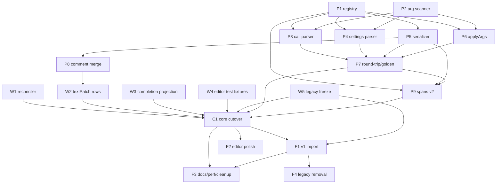

# DSL v2 移行 親計画(確定仕様・全体方針・依存グラフ)

## Context

現行 DSL は要素属性が 1 行に横並びし(`point B = offset A dx=0 dy=-(bust / 4)`)、
作図が複雑になるほど可読性が落ちる。これを縦型の関数呼び出し構文(`nui 2`)へ移行する。

```text
point 点B = offset(
  from: 点A
  dx: 100
  dy: 0
)
```

変わるのは DSL の表層構文と、それを支える parser/compiler/serializer/編集基盤だけである。
本計画は `docs/overhaul/` とは独立しており、参照しない。

オーナー確定事項:

- 通常要素は縦型 call が正準。1 行形式は入力として受理。カンマ不要。
- コンテナは「式直書きヘッダ型」: `group 名 {` / `if 名 (条件式) {` /
  `for 名 (i from: 0 count: 3 step: 1) {`。if の条件と for の変数は先頭の位置引数、
  残りは要素と同じ `key: value`。
- 式だけの変数は短形式 `var bust = 840` を正準として残す。
- 保存形式の破壊的変更は許容。二重文法を live parser に長く残さない。

## 不変条件(全タスク共通・絶対に守る)

- 要素の意味・参照・評価結果・mm 単位・Y-up・文書順評価は変更しない。
- `evaluate_document(input)` の Rust 境界と CadElement JSON の形は変更しない。
  Rust / `src-tauri/` には触れない。parity fixture(`test/fixtures/evaluation/`、
  CadElement JSON)も触れない。
- `sourceText` が保存対象かつ唯一の正。Canvas・コマンドの変更は対象 statement だけを
  splice する。全文再シリアライズを通常の変更経路に追加しない。
- 触れない statement のコメント・空行・手書きレイアウトはバイト同一で保持する。
- Inspector は読み取り専用のまま。キーボード操作第一級。Tauri のみ製品対象。
- 参照先の自動並べ替え・自動修復はしない。依存エラーは明示的に診断する。
- 巨大ファイルへ詰め込まず、責務ごとの小モジュールに分割する。

## 全体戦略

parser・compiler・serializer・`layoutElementTree`・`textPatch`・reconciler は
「patch 出力 ≡ serializer 出力」の整合ループを成す。文法切替をコミット間に分割すると
全員が両方言を話す必要が生じるため、**live parser に二重文法は置かない**。代わりに:

1. **未接続の先行実装(P 群)** — 新文法の registry・スキャナ・parser・serializer・
   compiler 適用・golden fixture・コメントマージ・値 span 解決を、製品コードから
   import しない新規モジュール+テストとして先に積む。リスクはここで消化する。
2. **v1 のままの配線改善(W 群)** — reconciler の全行化、textPatch の行群化と
   複数行 statement 差し替え対応、補完の論理文入力化、エディタ系テストのリテラル
   間接化、v1 パイプラインの凍結コピー。すべて現行 v1 文法のまま green で着地する。
3. **最小のコア切替(C1)** — 上記が済んだ時点で、切替は「配線+旧経路削除+
   テストリテラル差し替え(P7 で事前作成済み)」だけになる。
4. **後続(F 群)** — v1 文書の open 時変換、補完仕上げ、docs/性能/削除。

移行全体のテコ: **縦型 statement の論理射影(行結合)はそのまま有効な 1 行形式**である。
statement グルーピング層(`logicalStatementSourceMap.ts`)をバックスラッシュ継続から
括弧バランス継続へ替えれば、`statementProjectionAt` より下流(値 span・Alt+←/→・
pick-from-selection・jump)は既存の形のまま動く。

### 難所(単一行前提が残る 3 箇所)

1. `src/document/statementReconciler.ts:139-141` — 安定 ID 継承の LCS が statement の
   先頭物理行しか見ない。→ W1
2. `src/document/textPatch.ts:303-317`(`patchElements`)— 複数行 statement の構造的
   更新を `UnappliedTextPatchError` で拒否。→ W2
3. 補完コンテキスト(`src/editor/cmAutocomplete.ts` + `dslCompletionContextAt`)が
   単一物理行判定。→ W3

Canvas ピック・コマンドライン作図・ghost preview・rename はテキストを直接生成せず、
`CadElement[]` 変更 → `commitDocumentChange` → `buildTextPatch` → serializer の bridge を
通るため、serializer と textPatch が複数行を話せば自動追従する。Undo はテキスト
スナップショットで構造変更なし。

---

## 確定仕様 1: 文法(`nui 2`)

### 1.1 statement のグルーピング(バックスラッシュ継続の置換)

- 非空行・非構造行(`{` `}` `} else {`)で statement が始まる。コメント除去後、
  depth 0 の `(` / `[` が未閉なら次行へ継続し、depth が 0 に戻るまでを 1 statement と
  する(quote-aware)。
- 継続中に **空行 / 構造行 / EOF** に当たったら「未閉の呼び出し」エラー(その
  statement のみに限定)。空行が封じ込め境界になり、書きかけの `(` が残りの文書を
  飲み込まない。
- 呼び出し内部の全行コメント(`# …` 単独行)は許可(statement の行範囲に含まれる)。
- バックスラッシュ継続は削除(nui 2 では構文エラー)。
- 論理テキスト = 断片を単一スペースで結合(既存機構を流用。先頭断片は原文、
  継続断片は trim)。

### 1.2 要素文

```text
point 点B = offset(
  from: 点A
  dx: 100
  dy: 0
)
```

- `<category> [名前] = <construction>( 引数… )`。category は
  `point / line / curve / arc / text / image / var`。
- **(category, construction) の組が要素型を決める**。`point/offset` と `line/offset`、
  `point/polar` と `line/polar` の同名 construction は設計上許容(診断も category
  スコープ)。category と construction の不一致は診断。
- 引数は `key: value`(`:` の後に空白必須)。縦型では value は行末まで(コメント
  除去後)なので式に括弧が要らない: `distance: @縫い代幅 * 2`。
- **正準出力は常に縦型**(1 引数 1 行、statement インデント +2 スペース、`)` は
  単独行)。例外は `var 名 = 式` の短形式とコンテナヘッダのみ。
- 1 行形式は入力として受理: `point A = coordinate(x: 50 y: -50)`。引数境界は depth 0
  の `identifier:`+空白 のスキャンで決まる(式は `:` を含まない。record は `[]`
  内 = depth>0 なので衝突しない)。混在形式も受理。
- 無名要素: `point = coordinate(...)`。
- 共通属性は普通の引数。正準順: construction 固有引数(registry 順)→ `locked` →
  `visible` → `enabled` → `color` → `steps` → `vars`(flat/test 時のみ `varIds`,
  `id`)→ `roles`(group)→ `parent`/`branch`(非連続親のフラット fallback のみ)。
  非デフォルト時のみ出力(現行 `commonBaseAttrs` と同方針)。
- `element 名 type=…` 汎用形と `key=value` 属性構文は全廃。
- 値の表現: 数値式・`@変数`・参照名・修飾参照 `前身頃::交点`・派生点 `線.start`・
  座標 `(0, 0)`・文字列 `"…"`・choice(`left` 等の裸トークン)・boolean・
  参照リスト `[AB, shoulder]`(カンマ区切り維持)・record リスト
  `steps: [ratio: 0.01]` / `vars: [高さ: 10; 幅: @x * 2]`(`;` 区切り、`: ` 正準)。
  `intermediates` は現行 record 形式(`[anchor:angle:in:out;…]`)を維持。

### 1.3 コンテナ(式直書きヘッダ型・ヘッダは 1 行)

```text
group 前身頃 {
}

group 印刷対象 (printEnabled: true roles: [seam]) {
}

if 見返し (@見返し有 > 0) {
} else {
}

for 繰返し (i from: 0 count: 3 step: 1) {
}
```

- if の条件・for の変数は**先頭の位置引数**(位置引数 = 最初の depth 0 `key:` 境界
  までのトークン列)。残りは `key: value`(共通属性も同様)。名前は省略可能。
- コンテナヘッダは 1 行限定(単純化)。`{` はヘッダ行末尾が正準、次行単独 `{` も
  入力受理(現行どおり)。`}` / `} else {` は現行のまま単独行。
- 位置引数スロットは registry の schema で宣言されたもの(if.condition,
  for.variable)にだけ存在する。要素 call に位置引数はない。

### 1.4 設定系・その他の文

| 文 | 新正準形 |
|---|---|
| version | `nui 2` |
| color | `color pattern-black ("#31322f" name: "基本線" default: true)`(hex は位置引数) |
| role | `role seam (name: "縫い代")` |
| view | `view 通常 (default: true seam: false)`(role 可視キーは動的) |
| activeView / activePrintLayout | `activeView 通常` / `activePrintLayout A4`(現行どおり) |
| @stop | `@stop`(現行どおり) |
| printLayout | 縦型 call ヘッダ + ブロック(下記) |
| layoutVar | `layoutVar margin = 15`(var と同じ短形式) |
| place | `place 前身頃 (at: (0, margin) angle: 0 mirrorX: false)`(グループ名は位置引数) |

```text
printLayout A4 (
  output: pdf
  view: 印刷
  paper: a4
  orientation: portrait
  columns: 2
  rows: 2
  overlap: 10
  scale: 1
  canvas: (410, 584)
) {
  layoutVar margin = 15
  place 前身頃 (at: (0, margin) angle: 0 mirrorX: false)
}
```

- ブロック開始 `{` は「ヘッダの最終行の末尾」に付く: 1 行ヘッダなら行末、縦型
  printLayout ヘッダなら `) {`。
- 将来のモジュール呼び出し `use ノッチ1 = 凸ノッチ(...)` は要素 call と同形。
  `use` を category キーワードとして予約(「未対応」診断)し、他の手当は不要。

### 1.5 コメントと整形規則

- EOL コメントはヘッダ行・各引数行・`)` 行に置ける。呼び出し内の全行コメントも可。
- patch 時のコメント保存契約: EOL コメントは**引数キー単位**で再付着。全行コメントは
  直後の引数キーの前へ再付着(そのキーが消えたら `)` の前へ)。触れない statement は
  バイト同一。
- 末尾改行・セクション区切り(`\n\n`)は現行踏襲。インデントは非意味(見た目のみ)、
  正準は statement の深さ ×2 スペース。

### 1.6 診断(すべて statement スコープ)

未知 category / 未知 construction(その category の候補列挙)/ category・construction
不一致 / 未知引数(その construction の引数列挙)/ 重複引数 / 必須引数不足(参照系のみ
必須、数値は factory デフォルト)/ 空の値 / 未閉呼び出し(空行・構造行・EOF)/ `)` 後の
余剰トークン(ブロック合法位置の `{` を除く)/ 位置引数の重複・非対応位置引数。
既存診断(scope 内重複名、`@stop` 一意性、ブロック構造、printLayout メンバ制限)は維持。

---

## 確定仕様 2: 構文対応表(全 27 要素型 + 非要素文)

`*` = 必須引数。`→` は引数名→parameterKey(省略時同名)。正準出力は縦型(表では
1 行形式で表記)。

| # | 型 | 現行構文 | 新構文 |
|---|---|---|---|
| 1 | freePoint | `point A = (0, 0)` | `point A = coordinate(x: 0 y: 0)` |
| 2 | offsetPoint | `point B = offset A dx=0 dy=-(bust / 4)` | `point B = offset(from*→fromPoint: A dx: 0 dy: -(bust / 4))` |
| 3 | polarOffsetPoint | `point C = polar A angle=-45 distance=80` | `point C = polar(from*→fromPoint: A angle→angleDeg: -45 distance: 80)` |
| 4 | divisionPoint | `point D = between A B ratio=0.5` | `point D = between(start*→startPoint: A end*→endPoint: B ratio: 0.5)`(`distance` xor `ratio`、存在側が `placementMode` を決める) |
| 5 | lineDivisionPoint | `point E = on AB.end distance=20` | `point E = onLine(from*→endpoint: AB.end distance: 20)`(`ratio` も可) |
| 6 | intersectionPoint | `point X = intersection AB shoulder index=0 extensions=false` | `point X = intersection(line1*→line1Id: AB line2*→line2Id: shoulder index→intersectionIndex: 0 extensions→useExtensions: false)` |
| 7 | lineTangentOffsetPoint | `point H = tangentOffset armhole base=A angle=90 distance=12` | `point H = tangentOffset(line*→baseLineId: armhole base→basePoint: A angle→tangentAngleDeg: 90 distance: 12)` |
| 8 | line | `line AB = A -> B` | `line AB = segment(start*→startPoint: A end*→endPoint: B)` |
| 9 | angleLengthLine | `line shoulder = from A angle=-12 length=130` | `line shoulder = polar(start*→startPoint: A angle→angleDeg: -12 length: 130)` |
| 10 | offsetLine | `line seam = offset [AB,shoulder] distance=10 side=left closed=false` | `line seam = offset(sources*→baseLineIds: [AB, shoulder] distance→offset: 10 side: left closed: false suppressTrimWarnings: true)` |
| 11 | splitLine | `line lower = split armhole at=D` | `line lower = split(source*→baseLineId: armhole at*→splitPoint: D)` |
| 12 | extendTrim | `line adjusted = extend shoulder.end to=E` | `line adjusted = extend(end*→endpoint: shoulder.end to*→point: E)` |
| 13 | copyLine | `element c type=copyLine startPoint=… baseLineIds=[l1]` | `line 複写 = copy(startPoint*: … endPoint*: … scale: 1 angleDeg: 0 mirrorX: false baseLines*→baseLineIds: [l1])` |
| 14 | move | `element m type=move …`(糖衣なし) | `line 移動 = move(…copy と同一引数)` |
| 15 | symmetricCopyLine | `element … type=symmetricCopyLine …` | `line ミラー複写 = mirrorCopy(axis1*→axisPoint1: P1 axis2*→axisPoint2: P2 baseLines*→baseLineIds: […])` |
| 16 | symmetricMove | `element … type=symmetricMove …` | `line ミラー移動 = mirrorMove(…mirrorCopy と同一引数)` |
| 17 | edge | `element … type=edge endpoint1=… endpoint2=… intersectionIndex=0` | `line 縁 = edge(end1*→endpoint1: AB.end end2*→endpoint2: CD.start index→intersectionIndex: 0)` |
| 18 | bezierCurve | `curve armhole = A -> B startAngle=-90 startLength=35 endAngle=180 endLength=45 intermediates=[…]` | `curve armhole = bezier(start*→startPoint: A end*→endPoint: B startAngle→startHandleAngleDeg: -90 startLength→startHandleLength: 35 endAngle→endHandleAngleDeg: 180 endLength→endHandleLength: 45 intermediates→intermediatePoints: […record 形式維持])` |
| 19 | arcLine | `arc neckline center=A radius=90 start=180 end=270` | `arc neckline = arc(center*→centerPoint: A radius: 90 start→startAngleDeg: 180 end→endAngleDeg: 270)` |
| 20 | threePointArcLine | `arc three = through A B C start=180 end=270` | `arc three = through(point1*: A point2*: B point3*: C start→startAngleDeg: 180 end→endAngleDeg: 270)` |
| 21 | cornerRadiusArcLine | `arc r = corner AB.end shoulder.start radius=10 index=0` | `arc r = corner(end1*→endpoint1: AB.end end2*→endpoint2: shoulder.start radius: 10 index→intersectionIndex: 0)` |
| 22 | text | `text label = "前身頃" at=A size=5` | `text label = label(text*: "前身頃" anchor: A size→fontSize: 5)` |
| 23 | image | `element … type=image sourcePath=… originPoint=…` | `image 下絵 = image(source*→sourcePath: "front.png" origin→originPoint: A naturalWidthPx: … naturalHeightPx: … sourceDpi: … targetPixelsPerMm: … scale: 1 angleDeg: 0 mirrorX: false)` |
| 24 | variable(式) | `var bust = 840` | `var bust = 840`(短形式が正準。非デフォルト属性がある時のみ `var x = expression(value→expression: … scope: group …)`) |
| 25 | variable(測定) | `var w = 0 mode=pointDistance point1=A point2=B` | `var 肩幅 = pointDistance(point1: A point2: B)` / `pointAngle(point1 point2)` / `pointLineDistance(point: P line→lineId: L)`(construction が `valueMode` を preset) |
| 26 | group | `group 前身頃 {` / `printEnabled=true printAnchor=…` | `group 前身頃 {` / `group 前身頃 (printEnabled: true printAnchor: (10, 20) roles→visibilityRoleIds: [seam]) {` |
| 27 | conditionalGroup | `if 見返し condition=1 { } else { }` | `if 見返し (条件式) { } else { }`(条件は位置引数) |
| 28 | forGroup | `for 繰返し i start=0 count=3 step=1 {` | `for 繰返し (i from*→start: 0 count*: 3 step: 1 showGenerated: true) {`(変数は位置引数→variableName) |

オーナー例からの明示的逸脱(理由付き): `onLine` は `line:`+`endpoint:` の 2 引数に
分けず `from: 線.start` の単一 endpoint トークンにする。`LineEndpointReference` は
コード全体(rename カタログ・値 span・補完候補・`resolveEndpoint`)で 1 参照スロット
であり、2 引数化は「1 パラメータ = 1 span」モデルを壊すため。`steps` は共通引数として
全数値持ち要素で使える。

削除される v1 構文: `->`・`from`/`between`/`on`/`offset`/`polar`/`intersection`/
`split`/`extend`/`corner`/`through` の位置糖衣、`key=value` 属性、`element type=…`、
バックスラッシュ継続、`parameterAlias`、`profile`/`activeProfile` 別名、place の
`overlapMm=`/`angleDeg=` 等の別名属性。

---

## 確定仕様 3: 公開型・主要インターフェース

```ts
// src/dsl/dslConstructions.ts(新規 — 唯一の registry)
export type DslArgSpecial = "vars" | "varIds" | "steps" | "roles" | "intermediates"
  | "id" | "parent" | "branch";
export type DslArgSpec = {
  arg: string;                 // 記述名 ("start")
  parameterKey?: string;       // parameterDefinitions キー ("startPoint")。省略時 arg と同名
  required?: boolean;
  positional?: boolean;        // if.condition / for.variable だけ true
  special?: DslArgSpecial;     // findParameterDefinition 経由でない特別引数
};
export type DslConstructionSpec = {
  category: "point" | "line" | "curve" | "arc" | "text" | "image" | "var"
    | "group" | "if" | "for";
  construction: string;        // コンテナは ""(キーワードヘッダ)
  elementType: CadElementType;
  preset?: Partial<CadElement>;          // 例 { valueMode: "pointDistance" }
  exclusiveGroups?: string[][];          // [["distance","ratio"]]
  args: DslArgSpec[];                    // 正準順(共通属性より前)
};
export const constructionFor: (category: string, construction: string) => DslConstructionSpec | null;
export const constructionForElementType: (type: CadElementType) => DslConstructionSpec;
export const argNameForParameter: (type: CadElementType, parameterKey: string) => string | null;
export const commonArgSpecs: DslArgSpec[];
```

registry の引数は既存 `src/parameters/parameterDefinitions.ts` のキーへ写像し、
kind(number/reference/…)・step levels はそちらを唯一の正とする(整合性テストで担保)。

```ts
// src/dsl/dslTypes.ts — statement union の縮小(C1 で切替)
export type DslStatement =
  | 設定系 kind は現状維持 (role/view/activeView/printLayout/activePrintLayout/place/
      color/version/atStop/layoutVar/blockEnd/blockElse)
  | (DslStatementBase & { kind: "variable"; expression: string })   // 短形式のみ
  | (DslStatementBase & { kind: "group" })
  | (DslStatementBase & { kind: "element"; type: CadElementType | null;
      category: string; construction: string });
// 削除される kind: freePoint, offsetPoint, polarOffsetPoint, line,
// angleLengthLine, arcLine, text(すべて "element" へ統合)
// DslAttribute は形を維持。attrs は記述引数名 + 引数ごとの論理 span を運ぶ
```

```ts
// src/dsl/dslArgScanner.ts(新規 — 論理テキスト上の純粋スキャナ)
export type ScannedArg = { key: string | null;  // null = 位置引数
  keySpan: DslSpan | null; value: string; valueSpan: DslSpan };
export const scanCallArgs: (logicalText: string, callSpan: DslSpan)
  => { args: ScannedArg[]; errors: { message: string; span: DslSpan }[] };
```

```ts
// src/dsl/dslSerializer.ts — ブロック構造出力
export type SerializedStatement = {
  header: string;               // "point 名 = coordinate(" | "group 名 (…)" | 短形式全文
  args: Array<{ key: string; text: string }>;   // "x: 50"(インデントなし)
  close: ")" | null;
};
export const serializeElementStatementBlock: (e, refs) => SerializedStatement;
export const serializeElementStatementLogical: (e, refs) => string;
// Logical = 正準 1 行結合。textPatch の変更検出 diff・dslCompletionMetadata の
// サンプル導出・reconciler 隣接比較が使う
```

```ts
// src/dsl/dslDocument.ts
export type ElementTreeRow = {          // ElementTreeLine を置換
  lines: string[];                      // この行の(インデント済み)物理行群
  argKeys: (string | null)[];           // lines と並行。header/close は null
  depth: number;
  role: "statement" | "blockStart" | "blockEnd" | "blockElse" | "atStop";
  elementId?: ElementId;
  fallback?: boolean;
};
// StatementInfo / StatementMap は変更なし(line/endLine/range が既に複数行対応)

// src/document/statementCommentMerge.ts(新規)
export const mergeStatementComments: (input: {
  oldLines: readonly string[];
  oldArgLineByKey: ReadonlyMap<string, number>;
  next: SerializedStatement;
  indent: string;
}) => string[];
```

シグネチャ不変: `createLogicalStatementSourceMap` / `parseDslSnapshot` /
`statementProjectionAt` / `dslDocumentValueSpansAt` / `buildTextPatch` /
`compileDslDocument`。`dslCompletionContextAt(lineText, pos)` はシグネチャ維持で
意味変更(lineText = 論理テキスト、pos = 論理オフセット。呼び出し側が変わる)。

### モジュール分割の最終形

新規: `dslConstructions.ts` / `dslConstructionsSettings.ts` / `dslArgScanner.ts` /
`dslCallParser.ts` / `dslSettingsParser.ts` / `dslSerializeElement.ts` /
`src/document/statementCommentMerge.ts` / `src/document/legacyDsl/`(凍結コピー)。

改修: `logicalStatementSourceMap.ts`(括弧グルーピング化)/ `dslParser.ts`
(オーケストレーションへ縮小、目標 <300 行)/ `dslCompiler.ts`(registry 駆動
`applyArgs` へ統合、`parameterAlias` 削除、目標 <600)/ `dslSerializer.ts` /
`dslDocument.ts` / `dslCompletionContext.ts` / `dslCompletionMetadata.ts` /
`dslParameterSpans.ts` / `dslHighlight.ts` / `dslValueSpans.ts` / `textPatch.ts` /
`statementReconciler.ts` / `cmAutocomplete.ts`。

---

## 移行・v1 の扱い

- 既存 `.nui`(v1)は **open 時の一回変換**: v1 検出 → 凍結 legacy parser で parse →
  `CadElement[]` → 新 serializer で正準 v2 → dirty で開く。保存で v2 化。コメント・
  手書きレイアウトは変換で失われる(許容)。`.nuinui.json` importer は現行のまま
  (出力が v2 になるだけ)。
- `src/document/legacyDsl/` の削除基準: ローカルの全 `.nui` を一度 open+save して
  v2 化したことをオーナーが確認 → 1 リリース相当の運用後に削除(F4)。
- C1 直後〜F1 完了までの間、v1 ファイルは version エラーで開けない(既知の中間状態。
  F1 を C1 の直後に実施する)。

## 依存グラフ



## 子タスク一覧

一覧と状態管理は [README.md](README.md)。各タスクの詳細は `tasks/` の各文書。

- **P 群(未接続の先行実装)**: P1 registry / P2 引数スキャナ / P3 call parser /
  P4 設定文 parser / P5 registry 駆動 serializer / P6 compiler 引数適用 /
  P7 round-trip 行列と v2 golden / P8 コメントマージ / P9 値 span v2 解決
- **W 群(v1 のまま配線改善)**: W1 reconciler 複数行化 / W2 textPatch 行群化 /
  W3 補完の論理文入力化 / W4 エディタ系テストのリテラル間接化 /
  W5 v1 パイプラインの凍結コピー
- **C1 コア切替**
- **F 群(後続)**: F1 v1 open 変換 / F2 補完・ハイライト仕上げ /
  F3 docs・性能・残骸削除 / F4 legacy 削除(条件付き・後日)

## 品質ゲート(全タスク共通)

- 毎タスク: `npm test` / `npm run build` / `npm run lint` green。
- `npm run test:parity` は C1 で 1 回実行し、無変更 green を証明する。
- Rust 変更なしのため `cargo fmt/test/clippy` は不要(hand-back で明記)。
- F1 で `npm run desktop:build` スモーク(保存経路に触れるため)。

## 全体受入条件

1. 全要素の正準 serializer 出力が縦型 call(1 引数 1 行、カンマなし)。1 行形式は
   入力受理。serialize∘parse は冪等。
2. `nui 2` 文書が無損失 round-trip。`sourceText` 正準維持。Canvas/コマンド編集は
   対象 statement のみ splice。触れない statement のコメント・空行・手書き
   レイアウト、および触れた statement 内コメント(仕様 1.5)を保存。
3. 要素の意味・参照・mm/Y-up・文書順評価・`evaluate_document` payload・parity
   fixture は無変更で green。
4. 値 span・クリック/Tab・Alt+←/→・補完(既存全種 + construction/引数名)・Canvas
   ピック・安全 rename・Undo が、複数行 statement の任意の物理行で機能。
5. v1 `.nui` は open 時に一回変換され dirty で開き、保存で v2 になる。v3+ は拒否。
6. C1 以降、live parser に二重文法なし。全タスク境界で `npm test`/`build`/`lint` green。

## 明示的に選んだ単純化・対象外

- モジュール `use` は文法予約のみ(実装しない)。
- call 本体の折りたたみなし(group fold のみ継続)。
- 複数行に跨るリスト/record 値なし(値は 1 引数行内で閉じる)。コンテナヘッダは
  1 行限定。
- v1→v2 変換でコメント・手書きレイアウトは保存しない(要素・構造・順序のみ)。
- Inspector 変更なし。`StatementMap` への引数レベルエントリ追加なし(引数 span は
  parse 済み statement 側)。
- Rust / `src-tauri` 変更なし。`intermediates` の record 形式は据え置き。
