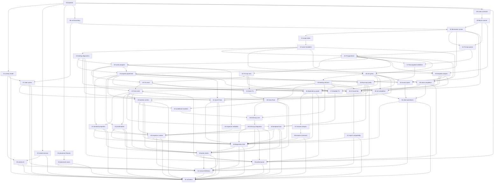

# 型付き変数・レキシカルスコープ実行計画

このdirectoryは[plan.md](plan.md)の仕様を、1 Sonnet session / 1 branch / 1 PRで実行できる単位へ分割した実装計画である。最終分割は53 task。数合わせではなく、parser、analysis、TS reference、Rust parity、production connection、UI、release gateを独立完了できる境界から決めた。

## 実行ルール

- 着手前に`plan.md`、`decisions.md`、自task、依存taskの引き継ぎを読む。
- 依存PRがmainへmergeされ、前提APIがmainに存在してからbranchを作る。
- task文書のbranch slugは推奨名。実際のprefixは実装環境/repository運用に従う。
- 1 taskで主責務を増やさない。後続task用の仮production実装を入れない。
- 状態は`未着手 / 進行中 / 完了 / 保留(理由)`。
- 共通gateは`npm test`、`npm run build`、`npm run lint`。Rust/評価taskは文書指定の追加gateも実行する。

## タスク一覧

| # | task | domain | depends | connection at completion | branch slug | status |
|---|---|---|---|---|---|---|
| 00 | [baseline compatibility/performance fixtures](tasks/00-baseline-compat-performance-fixtures.md) | test foundation | - | fixtures only | `typed-vars/00-baseline-fixtures` | 完了 |
| 01 | [activity domain/legacy bridge](tasks/01-activity-domain-legacy-bridge.md) | activity | 00 | production internal model | `typed-vars/01-activity-domain` | 完了 |
| 02 | [locked removal](tasks/02-locked-removal.md) | cleanup | 00 | production removal | `typed-vars/02-locked-removal` | 未着手 |
| 03 | [activity command/UI](tasks/03-activity-command-ui.md) | command/editor UI | 01,02 | production UI | `typed-vars/03-activity-ui` | 未着手 |
| 04 | [DivisionPlacement characterization](tasks/04-division-placement-characterization.md) | compatibility tests | 00 | fixtures only | `typed-vars/04-placement-characterization` | 未着手 |
| 05 | [DivisionPlacement union](tasks/05-division-placement-union.md) | model/evaluation | 04 | production refactor | `typed-vars/05-placement-union` | 未着手 |
| 06 | [nui 3 version boundary](tasks/06-nui3-version-boundary.md) | DSL/document | 00 | production plumbing; v2 unchanged | `typed-vars/06-nui3-boundary` | 未着手 |
| 07 | [nui 3 state syntax](tasks/07-nui3-state-syntax.md) | activity DSL | 01,06 | production v3 syntax | `typed-vars/07-state-syntax` | 未着手 |
| 08 | [scalar type contracts](tasks/08-scalar-type-contracts.md) | scalar core | 00 | unconnected library | `typed-vars/08-scalar-contracts` | 未着手 |
| 09 | [scalar literal scanner](tasks/09-scalar-literal-scanner.md) | DSL scanner | 08 | unconnected library | `typed-vars/09-literal-scanner` | 未着手 |
| 10 | [typed declaration syntax](tasks/10-typed-declaration-syntax.md) | DSL parser/serializer | 06,09 | feature-gated syntax | `typed-vars/10-declaration-syntax` | 未着手 |
| 11 | [lexical scope index](tasks/11-lexical-scope-index.md) | binding analysis | 10 | analysis only | `typed-vars/11-scope-index` | 未着手 |
| 12 | [binding name resolution](tasks/12-binding-name-resolution.md) | binding analysis | 11 | analysis only | `typed-vars/12-binding-resolution` | 未着手 |
| 13 | [binding diagnostics/initializer graph](tasks/13-binding-diagnostics-initializer-graph.md) | diagnostics | 12 | analysis only | `typed-vars/13-binding-diagnostics` | 未着手 |
| 14 | [TS expression parser](tasks/14-ts-expression-parser.md) | typed expression | 09,10 | unconnected AST | `typed-vars/14-ts-expression-parser` | 未着手 |
| 15 | [TS expression typechecker](tasks/15-ts-expression-typechecker.md) | typed expression | 12,14 | unconnected typecheck | `typed-vars/15-ts-expression-typecheck` | 未着手 |
| 16 | [TS expression reference evaluator](tasks/16-ts-expression-reference-evaluator.md) | typed expression | 15 | reference only | `typed-vars/16-ts-expression-eval` | 未着手 |
| 17 | [Rust expression payload validation](tasks/17-rust-expression-payload-validation.md) | Rust typed expression | 14,15 | shadow validator | `typed-vars/17-rust-expression-payload` | 未着手 |
| 18 | [Rust expression evaluator parity](tasks/18-rust-expression-evaluator-parity.md) | Rust typed expression | 16,17 | shadow parity | `typed-vars/18-rust-expression-eval` | 未着手 |
| 19 | [compiled scalar program](tasks/19-compiled-scalar-program.md) | compiler/IPC | 13,15 | feature-gated IR | `typed-vars/19-scalar-program` | 未着手 |
| 20 | [TS const evaluation](tasks/20-ts-const-evaluation.md) | reference evaluation | 16,19 | gated reference path | `typed-vars/20-ts-const-eval` | 未着手 |
| 21 | [Rust const evaluation parity](tasks/21-rust-const-evaluation-parity.md) | production evaluation | 18,19,20 | gated Rust/shadow path | `typed-vars/21-rust-const-eval` | 未着手 |
| 22 | [property reference typecheck](tasks/22-property-reference-typecheck.md) | compiler/parameters | 13,15,19 | analysis only | `typed-vars/22-property-typecheck` | 未着手 |
| 23 | [standard property runtime](tasks/23-standard-property-runtime.md) | TS/Rust evaluation | 21,22 | gated runtime | `typed-vars/23-property-runtime` | 未着手 |
| 24 | [printEnabled runtime](tasks/24-print-enabled-runtime.md) | print state | 21,22 | gated print runtime | `typed-vars/24-print-enabled` | 未着手 |
| 25 | [boolean control-flow runtime](tasks/25-boolean-control-flow-runtime.md) | control flow | 18,21,22 | gated control runtime | `typed-vars/25-boolean-control-flow` | 未着手 |
| 26 | [text template analysis](tasks/26-text-template-analysis.md) | template/parser | 09,12,15 | analysis only | `typed-vars/26-template-analysis` | 未着手 |
| 27 | [text template TS evaluation](tasks/27-text-template-ts-evaluation.md) | reference evaluation | 16,20,26 | gated reference path | `typed-vars/27-template-ts` | 未着手 |
| 28 | [text template Rust parity](tasks/28-text-template-rust-parity.md) | production evaluation | 18,21,27 | gated Rust path | `typed-vars/28-template-rust` | 未着手 |
| 29 | [set syntax/resolution](tasks/29-set-syntax-resolution.md) | DSL/binding analysis | 10,12,15,19 | gated analysis | `typed-vars/29-set-syntax` | 未着手 |
| 30 | [binding version IR](tasks/30-binding-version-ir.md) | mutation core | 29 | gated IR | `typed-vars/30-binding-versions` | 未着手 |
| 31 | [linear mutation TS](tasks/31-linear-mutation-ts.md) | reference mutation | 16,20,30 | gated reference path | `typed-vars/31-linear-mutation-ts` | 未着手 |
| 32 | [linear mutation Rust parity](tasks/32-linear-mutation-rust-parity.md) | production mutation | 18,21,30,31 | gated Rust path | `typed-vars/32-linear-mutation-rust` | 未着手 |
| 33 | [conditional mutation](tasks/33-conditional-mutation.md) | control mutation | 25,32 | gated TS/Rust path | `typed-vars/33-conditional-mutation` | 未着手 |
| 34 | [forGroup mutation core](tasks/34-forgroup-mutation-core.md) | loop mutation | 30,32,33 | unconnected algorithm | `typed-vars/34-forgroup-mutation-core` | 未着手 |
| 35 | [forGroup mutation integration](tasks/35-forgroup-mutation-integration.md) | loop production | 34 | gated TS/Rust path | `typed-vars/35-forgroup-mutation` | 未着手 |
| 36 | [typed dependency graph](tasks/36-typed-dependency-graph.md) | dependency model | 13,22,26,29,30 | gated analysis | `typed-vars/36-dependency-graph` | 未着手 |
| 37 | [typed rename analysis](tasks/37-typed-rename-analysis.md) | rename safety | 36 | gated analysis | `typed-vars/37-rename-analysis` | 未着手 |
| 38 | [typed rename command](tasks/38-typed-rename-command.md) | command/text splice | 37 | gated command | `typed-vars/38-rename-command` | 未着手 |
| 39 | [typed value completion](tasks/39-typed-value-completion.md) | editor completion | 12,15,22,26 | gated editor | `typed-vars/39-value-completion` | 未着手 |
| 40 | [set/recovery completion](tasks/40-set-recovery-completion.md) | editor completion | 29,30,39 | gated editor | `typed-vars/40-set-completion` | 未着手 |
| 41 | [typed variable Quick Fixes](tasks/41-typed-variable-quick-fixes.md) | diagnostics/editor | 07,13,22,29,40 | gated editor | `typed-vars/41-quick-fixes` | 未着手 |
| 42 | [Inspector declaration metadata](tasks/42-inspector-declaration-metadata.md) | Inspector | 19 | gated UI metadata | `typed-vars/42-inspector-metadata` | 未着手 |
| 43 | [Source Editor span/navigation](tasks/43-source-editor-span-navigation.md) | editor | 10,22,26,29 | gated editor API | `typed-vars/43-source-spans` | 未着手 |
| 44 | [Source value operations/picker boundaries](tasks/44-source-value-operations.md) | editor interaction | 39,40,43 | gated editor UI | `typed-vars/44-source-value-ops` | 未着手 |
| 45 | [Inspector runtime values](tasks/45-inspector-runtime-values.md) | Inspector | 23,24,25,28,35,42 | gated final-value UI | `typed-vars/45-inspector-runtime` | 未着手 |
| 46 | [v3 serializer/round-trip/patching](tasks/46-v3-serializer-roundtrip-patching.md) | persistence | 07,10,22,26,29,30 | gated persistence | `typed-vars/46-v3-roundtrip` | 未着手 |
| 47 | [import/export compatibility](tasks/47-import-export-compatibility.md) | document boundary | 46 | production compatibility | `typed-vars/47-import-compat` | 未着手 |
| 48 | [integrated diagnostics E2E](tasks/48-integrated-diagnostics-e2e.md) | diagnostics hardening | 23,24,25,28,32,35,36,38,41,44,45,47 | gated release check | `typed-vars/48-diagnostics-e2e` | 未着手 |
| 49 | [full TS/Rust parity matrix](tasks/49-full-parity-matrix.md) | parity hardening | 21,23,24,25,28,32,35,48 | release gate | `typed-vars/49-parity-matrix` | 未着手 |
| 50 | [performance regression gates](tasks/50-performance-regression-gates.md) | performance | 00,13,18,21,35,36,39,49 | release gate | `typed-vars/50-performance` | 未着手 |
| 51 | [manual E2E/docs](tasks/51-manual-e2e-docs.md) | manual validation/docs | 03,05,07,41,44,45,47,48,49,50 | release checklist | `typed-vars/51-manual-e2e` | 未着手 |
| 52 | [nui 3 typed-variable activation](tasks/52-nui3-typed-variable-activation.md) | activation | 01,02,03,05,07,23,24,25,28,35,38,41,44,45,47,48,49,50,51 | production activation | `typed-vars/52-activation` | 未着手 |

## 依存グラフ

## Critical path

`00 → 08 → 09 → 10 → 11 → 12 → 13 → 14 → 15 → 16 → 17/18 → 19 → 20 → 21 → 29 → 30 → 31 → 32 → 33 → 34 → 35 → 45/48 → 49 → 50 → 51 → 52`

14〜18のexpression pathと11〜13のbinding pathは15で合流する。23〜28のproperty/template path、36〜44のdependency/editor pathもactivation前に合流する。

## 並行可能な作業

- 00後: 01(activity)、02(locked)、04(placement)、06(version)、08(scalar contracts)。
- 10後: 11(scope)と14(expression parser)。
- 21後: 22/property系、26/template系、29/set系、42/Inspector metadata。
- 35後: dependency/rename、completion/editor、runtime Inspector、persistenceを依存範囲内で並行。
- 48後: parity matrix。50のperformance gateと51のmanual checklistは必要成果が揃い次第準備可能だが、52は全gate待ち。

## Activation条件

52は次がすべてmainへmerge済みでなければ開始不可。

- activity: 01-03、07
- placement: 04-05
- typed evaluation: 08-35
- dependency/editor/UI: 36-45
- persistence/compatibility: 46-47
- hardening: 48-51

52で初めてtyped declaration feature gateを外し、新規document defaultを`nui 3`へ変更する。途中taskのgated implementationへproduction UIを直接つながない。

## 最初に実行可能なtask

00。既存numeric var、legacy scope、numeric text interpolation、v2 round-trip、activity/placement挙動をfixture化し、250/1000規模の計測protocolと記録フォーマットをmainへ置く。研究メモだけでは完了しない。

## Blocking decisions

なし。[decisions.md](decisions.md)に調査根拠を記録済み。将来範囲のqualified referenceやstring演算はblockingではなく明示的な対象外。

## 旧31-task案からの再編

- activityを「production内部model」「v3 state syntax」「production UI」へ分離し、nui3 gateへの矛盾を除去。
- TS expressionをparser/typecheck/reference evaluatorへ、Rustをpayload validation/evaluatorへ分離。
- bindingをscope index/name resolution/initializer graphへ分離し、constより前へ移動。
- const TS/Rust、text TS/Rust、linear mutation TS/Rustを別PR化。
- normal boolean、printEnabled、boolean control flowを別task化。
- set parser/resolutionをdeclaration parserから完全分離。
- forGroup mutationをpure coreとproduction integrationへ分離。
- dependency、rename analysis、rename commandを分離。
- value completion、set recovery completion、Quick Fixを分離。
- Inspectorをmetadataとfinal runtime valueへ分離し、runtime側をforGroup mutation後へ移動。
- Source span/navigationとvalue operationsを分離。
- final hardeningをdiagnostics、parity、performance、manual E2E、activationへ分離。
