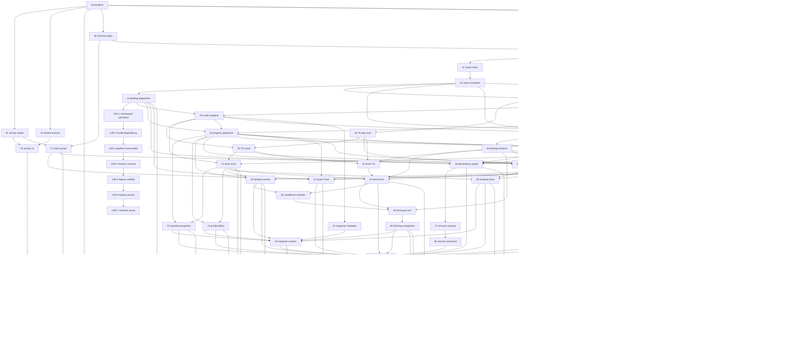

# 型付き変数・レキシカルスコープ実行計画

このdirectoryは[plan.md](plan.md)の仕様を、1 session / 1 branch / 1 PRで実行できる単位へ分割した実装計画である。Task 00〜52とTask 13後の補正Taskから成り、parser、analysis、TS reference、Rust parity、production connection、UI、manual migration、legacy removalを独立完了できる境界から決めた。

## 実行ルール

- 着手前に`plan.md`、`decisions.md`、自task、依存taskの引き継ぎを読む。
- 依存PRがmainへmergeされ、前提APIがmainに存在してからbranchを作る。
- task文書のbranch slugは推奨名。実際のprefixは実装環境/repository運用に従う。
- 1 taskで主責務を増やさない。後続task用の仮production実装を入れない。
- 状態は`未着手 / 進行中 / 完了 / 保留(理由)`。
- 共通gateは`npm test`、`npm run build`、`npm run lint`。Rust/評価taskは文書指定の追加gateも実行する。

## タスク一覧

| # | task | domain | depends | connection at completion | branch slug | status |
|---|---|---|---|---|---|---|
| 00 | [baseline compatibility/performance fixtures](tasks/00-baseline-compat-performance-fixtures.md) | test foundation | - | fixtures only | `typed-vars/00-baseline-fixtures` | 完了 |
| 01 | [activity domain/legacy bridge](tasks/01-activity-domain-legacy-bridge.md) | activity | 00 | production internal model | `typed-vars/01-activity-domain` | 完了 |
| 02 | [locked removal](tasks/02-locked-removal.md) | cleanup | 00 | production removal | `typed-vars/02-locked-removal` | 完了 |
| 03 | [activity command/UI](tasks/03-activity-command-ui.md) | command/editor UI | 01,02 | production UI | `typed-vars/03-activity-ui` | 完了 |
| 04 | [DivisionPlacement characterization](tasks/04-division-placement-characterization.md) | compatibility tests | 00 | fixtures only | `typed-vars/04-placement-characterization` | 完了 |
| 05 | [DivisionPlacement union](tasks/05-division-placement-union.md) | model/evaluation | 04 | production refactor | `typed-vars/05-placement-union` | 完了 |
| 06 | [nui 3 version boundary](tasks/06-nui3-version-boundary.md) | DSL/document | 00 | production plumbing; v2 unchanged | `typed-vars/06-nui3-boundary` | 完了 |
| 07 | [nui 3 state syntax](tasks/07-nui3-state-syntax.md) | activity DSL | 01,06 | production v3 syntax | `typed-vars/07-state-syntax` | 完了 |
| 08 | [scalar type contracts](tasks/08-scalar-type-contracts.md) | scalar core | 00 | unconnected library | `typed-vars/08-scalar-contracts` | 完了 |
| 09 | [scalar literal scanner](tasks/09-scalar-literal-scanner.md) | DSL scanner | 08 | unconnected library | `typed-vars/09-literal-scanner` | 完了 |
| 10 | [typed declaration syntax](tasks/10-typed-declaration-syntax.md) | DSL parser/serializer | 06,09 | feature-gated syntax | `typed-vars/10-declaration-syntax` | 完了 |
| 11 | [lexical scope index](tasks/11-lexical-scope-index.md) | binding analysis | 10 | analysis only | `typed-vars/11-scope-index` | 完了 |
| 12 | [binding name resolution](tasks/12-binding-name-resolution.md) | binding analysis | 11 | analysis only | `typed-vars/12-binding-resolution` | 完了 |
| 13 | [binding diagnostics/initializer graph](tasks/13-binding-diagnostics-initializer-graph.md) | diagnostics | 12 | analysis only | `typed-vars/13-binding-diagnostics` | 完了 |
| 13R-1 | [binding resolution / namespace correction](tasks/13r1-resolution-namespace.md) | binding analysis | 13 | analysis only | `typed-vars/13r1-resolution-namespace` | 完了 |
| 13R-2 | [invalid binding dependency propagation](tasks/13r2-invalid-dependency.md) | binding analysis | 13R-1 | analysis only | `typed-vars/13r2-invalid-dependency` | 完了 |
| 13R-3 | [binding pipeline linearization](tasks/13r3-binding-pipeline-linearization.md) | performance | 13R-2 | analysis only | `typed-vars/13r3-binding-pipeline` | 完了 |
| 13R-4 | [batch resolver owner contract / forward order](tasks/13r4-batch-resolver-contract.md) | binding analysis | 13R-3 | analysis only | `typed-vars/13r4-resolver-contract` | 完了 |
| 13R-5 | [legacy visibility lookup linearization](tasks/13r5-legacy-visibility-linearization.md) | performance | 13R-4 | analysis only | `typed-vars/13r5-legacy-visibility` | 完了 |
| 13R-6 | [binding lookup closure](tasks/13r6-binding-lookup-closure.md) | binding analysis/performance | 13R-5 | analysis only | `typed-vars/13r6-binding-lookup-closure` | 完了 |
| 13R-7 | [legacy declaration order / CAD container parity](tasks/13r7-legacy-container-parity.md) | binding analysis/performance | 13R-6 | analysis only | `typed-vars/13r7-legacy-container` | 完了 |
| 14 | [TS expression parser](tasks/14-ts-expression-parser.md) | typed expression | 09,10 | unconnected AST | `typed-vars/14-ts-expression-parser` | 完了 |
| 15 | [TS expression typechecker](tasks/15-ts-expression-typechecker.md) | typed expression | 12,14 | unconnected typecheck | `typed-vars/15-ts-expression-typecheck` | 完了 |
| 16 | [TS expression reference evaluator](tasks/16-ts-expression-reference-evaluator.md) | typed expression | 15 | reference only | `typed-vars/16-ts-expression-eval` | 完了 |
| 17 | [Rust expression payload validation](tasks/17-rust-expression-payload-validation.md) | Rust typed expression | 14,15 | shadow validator | `typed-vars/17-rust-expression-payload` | 完了 |
| 18 | [Rust expression evaluator parity](tasks/18-rust-expression-evaluator-parity.md) | Rust typed expression | 16,17 | shadow parity | `typed-vars/18-rust-expression-eval` | 完了 |
| 19 | [compiled scalar program](tasks/19-compiled-scalar-program.md) | compiler/IPC | 13,15 | feature-gated IR | `typed-vars/19-scalar-program` | 完了 |
| 20 | [TS const evaluation](tasks/20-ts-const-evaluation.md) | reference evaluation | 16,19 | gated reference path | `typed-vars/20-ts-const-eval` | 完了 |
| 21 | [Rust const evaluation parity](tasks/21-rust-const-evaluation-parity.md) | production evaluation | 18,19,20 | gated Rust/shadow path | `typed-vars/21-rust-const-eval` | 完了 |
| 22 | [property reference typecheck](tasks/22-property-reference-typecheck.md) | compiler/parameters | 13,15,19 | analysis only | `typed-vars/22-property-typecheck` | 完了 |
| 23 | [standard property runtime](tasks/23-standard-property-runtime.md) | TS/Rust evaluation | 21,22 | gated runtime | `typed-vars/23-property-runtime` | 完了 |
| 24 | [printEnabled runtime](tasks/24-print-enabled-runtime.md) | print state | 21,22 | gated print runtime | `typed-vars/24-print-enabled` | 完了 |
| 25 | [boolean control-flow runtime](tasks/25-boolean-control-flow-runtime.md) | control flow | 18,21,22 | gated control runtime | `typed-vars/25-boolean-control-flow` | 完了 |
| 26 | [text template analysis](tasks/26-text-template-analysis.md) | template/parser | 09,12,15 | analysis only | `typed-vars/26-template-analysis` | 未着手 |
| 27 | [text template TS evaluation](tasks/27-text-template-ts-evaluation.md) | reference evaluation | 16,20,26 | gated reference path | `typed-vars/27-template-ts` | 未着手 |
| 28 | [text template Rust parity](tasks/28-text-template-rust-parity.md) | production evaluation | 18,21,27 | gated Rust path | `typed-vars/28-template-rust` | 未着手 |
| 29 | [set syntax/resolution](tasks/29-set-syntax-resolution.md) | DSL/binding analysis | 10,12,15,19 | gated analysis | `typed-vars/29-set-syntax` | 未着手 |
| 30 | [binding version IR](tasks/30-binding-version-ir.md) | mutation core | 29 | gated IR | `typed-vars/30-binding-versions` | 未着手 |
| 31 | [linear mutation TS](tasks/31-linear-mutation-ts.md) | reference mutation | 16,20,30 | gated reference path | `typed-vars/31-linear-mutation-ts` | 未着手 |
| 32 | [linear mutation Rust parity](tasks/32-linear-mutation-rust-parity.md) | production mutation | 18,21,30,31 | gated Rust path | `typed-vars/32-linear-mutation-rust` | 未着手 |
| 33 | [conditional mutation](tasks/33-conditional-mutation.md) | control mutation | 25,32 | gated TS/Rust path | `typed-vars/33-conditional-mutation` | 未着手 |
| 34 | [forGroup mutation core](tasks/34-forgroup-mutation-core.md) | loop mutation | 30,32,33 | unconnected algorithm | `typed-vars/34-forgroup-mutation-core` | 未着手 |
| 35 | [forGroup mutation integration](tasks/35-forgroup-mutation-integration.md) | loop production | 34 | gated TS/Rust path | `typed-vars/35-forgroup-mutation` | 未着手 |
| 36 | [typed dependency graph](tasks/36-typed-dependency-graph.md) | dependency model | 13,22,26,29,30 | gated analysis | `typed-vars/36-dependency-graph` | 未着手 |
| 37 | [typed rename analysis](tasks/37-typed-rename-analysis.md) | rename safety | 36 | gated analysis | `typed-vars/37-rename-analysis` | 未着手 |
| 38 | [typed rename command](tasks/38-typed-rename-command.md) | command/text splice | 37 | gated command | `typed-vars/38-rename-command` | 未着手 |
| 39 | [typed value completion](tasks/39-typed-value-completion.md) | editor completion | 12,15,22,26 | gated editor | `typed-vars/39-value-completion` | 未着手 |
| 40 | [set/recovery completion](tasks/40-set-recovery-completion.md) | editor completion | 29,30,39 | gated editor | `typed-vars/40-set-completion` | 未着手 |
| 41 | [typed variable Quick Fixes](tasks/41-typed-variable-quick-fixes.md) | diagnostics/editor | 07,13,22,29,40 | gated editor | `typed-vars/41-quick-fixes` | 未着手 |
| 42 | [Inspector declaration metadata](tasks/42-inspector-declaration-metadata.md) | Inspector | 19 | gated UI metadata | `typed-vars/42-inspector-metadata` | 未着手 |
| 43 | [Source Editor span/navigation](tasks/43-source-editor-span-navigation.md) | editor | 10,22,26,29 | gated editor API | `typed-vars/43-source-spans` | 未着手 |
| 44 | [Source value operations/picker boundaries](tasks/44-source-value-operations.md) | editor interaction | 39,40,43 | gated editor UI | `typed-vars/44-source-value-ops` | 未着手 |
| 45 | [Inspector runtime values](tasks/45-inspector-runtime-values.md) | Inspector | 23,24,25,28,35,42 | gated final-value UI | `typed-vars/45-inspector-runtime` | 未着手 |
| 46 | [nui 3 serializer/round-trip/patching](tasks/46-v3-serializer-roundtrip-patching.md) | persistence | 07,10,22,26,29,30 | gated nui 3 persistence | `typed-vars/46-v3-roundtrip` | 未着手 |
| 47 | [existing document manual nui 3 migration](tasks/47-manual-nui3-migration.md) | migration operations | 51 | verified migrated documents | `typed-vars/47-manual-nui3-migration` | 未着手 |
| 48 | [integrated diagnostics E2E](tasks/48-integrated-diagnostics-e2e.md) | diagnostics hardening | 23,24,25,28,32,35,36,38,41,44,45,46 | gated release check | `typed-vars/48-diagnostics-e2e` | 未着手 |
| 49 | [full TS/Rust parity matrix](tasks/49-full-parity-matrix.md) | parity hardening | 21,23,24,25,28,32,35,48 | release gate | `typed-vars/49-parity-matrix` | 未着手 |
| 50 | [performance regression gates](tasks/50-performance-regression-gates.md) | performance | 00,13,18,21,35,36,39,49 | release gate | `typed-vars/50-performance` | 未着手 |
| 51 | [manual nui 3 E2E/docs](tasks/51-manual-e2e-docs.md) | manual validation/docs | 03,05,07,41,44,45,46,48,49,50 | migration-ready checklist | `typed-vars/51-manual-e2e` | 未着手 |
| 52 | [legacy removal / nui 3-only activation](tasks/52-nui3-typed-variable-activation.md) | removal/activation | 47 | nui 3-only production | `typed-vars/52-nui3-only-activation` | 未着手 |

## 依存グラフ

## Critical path

完了済みのTask 00〜19に続く残りのcritical pathは次のとおり。

`29 → 30 → 31 → 32 → 33 → 34 → 35 → 45 → 48 → 49 → 50 → 51 → 47 → 52`

Task 20/21のconst runtime pathはTask 31/32へ、Task 46のnui 3 persistence pathはTask 30後に並行してTask 48へ合流する。23〜28のproperty/template pathと36〜44のdependency/editor pathもTask 48/51までに合流する。

## 並行可能な作業

- Task 19完了後: 22(property typecheck)、26(template analysis)、42(Inspector metadata)は20と並行/独立に着手可能。
- Task 20完了後: 21(Rust const evaluation parity)に着手可能。
- Task 21・22完了後: 23(standard property runtime)、24(printEnabled runtime)、25(boolean control-flow runtime)に着手可能。
- Task 21後: property runtime、template runtime、set/mutation系を依存範囲内で並行。
- Task 30後: mutation pathとTask 46のnui 3 persistenceを並行。
- Task 35後: dependency/rename、completion/editor、runtime Inspectorを依存範囲内で並行。
- Task 48後: parity、performance、manual E2Eを順に完了し、Task 47の手動migration後だけTask 52へ進む。

## Activation条件

52はTask 47が完了し、次の順序がすべて満たされるまで開始不可。

1. activity、placement、typed evaluation、dependency/editor/UIのTask 01〜45が完了。
2. Task 46でnui 3 serializer・round-trip・production persistence経路が完成。
3. Task 48〜51でnui 3 diagnostics、TS/Rust parity、performance、manual E2Eが完了。
4. Task 47で現存ユーザー文書のinventory、手動nui 3更新、open/compile/evaluate/save/reopen確認が完了。

52でpre-nui 3 parser/importer/serializer/adapter/fallback/bridge/fixtureを削除し、残存legacy分岐がないことを確認してからtyped declaration feature gateを外し、新規document defaultを`nui 3`へ変更する。途中Taskのgated implementationへproduction UIを直接つながない。

## 次に実行可能なtask

直近は26、29、42。23・24・25は完了済み。Task 21でRust-first `evaluate_document(input)` がTask 19の解決済み`scalar_program`を評価し、`computedScalarBindings`をTS payloadへ返す。22の完了後に23〜25、26/27完了後に28、29〜31完了後に32がこのbinding environmentを再利用し、source再parse・名前再解決・legacy fallbackを追加しない。

### Task 22完了時点の引き継ぎ(23〜26向け)

`src/dsl/dslDocument.ts`の`compileDslDocument`は、typed宣言が1件以上ある`nui 3`文書で`scalarAnalysis`が得られた場合、`src/scalars/propertyBindingCompiler.ts`の`compilePropertyBindings`を呼び、結果を`CompiledDslDocument.propertyBindings?: ReadonlyMap<string, ScalarValueSource>`へ格納する(`scalarProgram`/`bindingAnalysis`と同じ並び)。診断は`compiled.diagnostics`へ通常のcompile diagnosticsとして統合済みで、エラーがあれば他のcompile errorと同じく`document: null`(last-good-document維持)になる。

- key形式は`propertyBindingOccurrenceKey(statementIndex, parameterKey)`(`src/scalars/propertyBindingCompiler.ts`からexport)。`parameterKey`はDSL引数名ではなくparameterDefinitionsの`key`(例: `intersectionPoint`の`extensions:`引数は`useExtensions`というkeyになる)。
- `ScalarValueSource`は現状`{kind:"literal"}`(未使用)と`{kind:"binding"; bindingId; type; span; nameSpan; name}`のみ。mapにkeyが存在しない場合はliteral(既存element fieldをそのまま使う)。
- 23(標準property)・24(printEnabled)・25(showGenerated)は、このmapを`bindingId`でTask 21の`computedScalarBindings`と突き合わせてruntime値を得ればよく、sourceの再parse・binding名の再解決は不要。
- 26(text template)は`text.text`が単独`@binding`のケースをこのmapから得られるが、`{...}`interpolation hole自体はTask 22の対象外であり、26が新たに解析する。
- `src/dsl/dslApplyArgs.ts`のboolean引数は`@`始まりの値に対して「true/false で指定してください」診断を出さないよう変更済み(Task 22でのbinding診断と重複させないため)。choice/text引数はもともと未検証だったため変更なし。

### Task 23完了時点の引き継ぎ(24〜25向け)

Task 23で`computedScalarBindings`の生成方式を、文書全体の評価ループが終わった後に一括評価する方式から、**on-demand・memoized resolver**方式へ変更した(TS: `src/scalars/declarationEvaluator.ts`の`createLazyScalarProgramEvaluator`/`finalizeScalarProgramEvaluation`、`src/geometry/scalarProgramEvaluation.ts`の`createDocumentScalarBindingResolver`。Rust: `src-tauri/src/evaluation/scalars/bindings.rs`の`ScalarBindingResolver`)。

- `resolve(bindingId)`はbindingの初期化子を初回参照時にだけ評価し、結果をmemoizeする。legacy var参照は`computedVariables`/`state.computed_variables`を**都度live読み**する(事前snapshot方式ではない)。これにより、評価ループの途中(要素のproperty materialize時)でも安全にbinding値を取得でき、`computedScalarBindings`の最終出力はscalar_programが存在する限り常に生成される(propertyBindingの有無に依存しない)。
- 循環参照はTask 13のcompile時diagnosticで既に排除されているが、defense-in-depthとして`in_progress`ガードを両言語に追加した(TS: 例外throw、Rust: `evaluation-binding-cycle-guard`という`ScalarEvaluation::Error`を返す)。
- `finalize()`/`finalizeScalarProgramEvaluation`は`program.statements`を順に走査してresolverから値を引くため、内部でどんな順序でbindingが解決されても出力mapの順序は不変。
- 24(printEnabled)・25(showGenerated)はこの同じresolver機構(`ScalarBindingResolver`/`createDocumentScalarBindingResolver`)を再利用してよい。それぞれの対象property専用のmaterialize adapter(`src/geometry/propertyBindingRuntime.ts`のような)を新設し、23の`STANDARD_PROPERTY_TARGETS`allowlistへ自分たちのpropertyを追加しないこと(scope越境になる)。
- property runtimeの生産経路は`src/components/AppLayout.tsx`(store `doc.scalarProgram`/`doc.propertyBindings`/`doc.statementMap`/`doc.document.elements`から`buildPropertyBindingRuntimeEntries`で構築)→`src/geometry/useEvaluationEngine.ts`(`propertyBindingEntries`をTS reference/Rust IPC両方へ転送)→`src/geometry/evaluate.ts`/Rust `mod.rs`が実際にmaterializeする、という一直線。24/25もこの同じ経路(AppLayout→useEvaluationEngine→evaluate.ts/mod.rs)に新しいentry種別を足す形で接続できる。
- Rust側のIPC payload形状(`EvaluationInput.property_bindings: Option<Value>`)と、7つの標準propertyペア+正準ScalarTypeを独自に検証する`property_binding_payload.rs`の設計は、24/25が新しいproperty pairを追加する際のテンプレートになる(Rustは常にTS payloadを無条件に信用せず、対象pairと期待型を自前で検証する)。

### Task 24完了時点の引き継ぎ(25/45向け)

Task 24は`group.printEnabled`を、Task 23の`STANDARD_PROPERTY_TARGETS`/`buildPropertyBindingRuntimeEntries`/`materializePropertyBoundElement`(=element clone→`evaluateElement`)経路には接続しなかった。理由: groupは`evaluate.ts`/Rust `evaluate_element_by_type`のどちらでも通常evaluationの対象外(groupを評価してdrawする概念がなく、materializeしても捨てられるだけ)であり、print traversal(`src/print/printGeometry.ts`)自体がTS-onlyでRust側に対応moduleがない。そのためAppLayout→useEvaluationEngine→evaluate.ts/mod.rsの一直線には乗らない。

- 新設した`src/geometry/groupPrintEnabledRuntime.ts`は、Task22で既に生成済みの`doc.propertyBindings`(occurrenceKey付きmap)と`doc.statementMap.byElementId`(elementId→StatementInfo)の**2つの既存lookupをそのまま連結するだけ**で、group.id→bindingIdをO(1)解決する(`resolveGroupPrintEnabledBindingId`)。新しいdocument-wide mapは一切生成しない — `GroupPrintEnabledLookup`はこの2つの既存参照を束ねただけの薄いエイリアス。
- `isGroupPrintEnabled(group, lookup, computedScalarBindings)`は、bindingが無ければ既存のliteral `printEnabled === true`判定にfall backし、boundならTask21が既に生成している`evaluation.computedScalarBindings`(TS/Rust両方で同一shape、`finalize()`で毎回全binding分生成済み)を1回引くだけ。poison/error/型不一致はすべて`false`(print除外)にfail closeする — `errors`/`warnings`へは一切書き込まない(Canvas/通常evaluationに影響しないという固定仕様どおり)。
- 接続点は`src/print/printGeometry.ts`の`printableGroups`/`printableItemsForLayout`/`printablePathsForLayout`(いずれも`groupPrintEnabledLookup`という追加optional引数)と、呼び出し側4箇所(`printSvgExport.ts`、`printPdfExport.ts`、`PrintLayoutView.tsx`の`PrintLayoutCanvas`/`PrintLayoutPanel`、`PrintLayoutPreviewWindow.tsx`)。いずれも既にstoreへ直接アクセスしているため、`state.doc.propertyBindings`/`state.doc.statementMap.byElementId`をそのまま渡すだけで、新しいscan/mapを各call siteで組み立てることはない。
- Rust側は無変更。`computed_scalar_bindings`はscalar_programが存在すれば常に生成される(property binding entriesの有無と無関係)ため、printEnabled解決に必要なRust側の値は既にTask21の時点で揃っている。`property_binding_payload.rs`の`canonical_expected_type`allowlistへ`("group","printEnabled")`を追加する誘い(同ファイルのコメント)には従っていない — これはTask23の標準property経路専用のallowlistであり、printEnabledをそこに混ぜるとgroupが通常evaluationのmaterialize対象になってしまう。
- `src/model/elementPresentationStatus.ts`の`printEnabled`フィールド(source editor gutter class `cm-eval-print-enabled`)はliteralのみのまま未着手。Task 24の引き継ぎどおりTask 45(Inspector runtime values)の対象。
- `toggleGroupPrintEnabled`/`toggleSelectedGroupPrintEnabled`(`src/commands/selectionCommands.ts`)は無変更 — bound printEnabledをliteralで上書きしてしまう。ただし他6つのopt-inプロパティにも同種のwrite-guardは存在せず、これはTask24固有の新規gapではない。
- 25(forGroup.showGenerated)はcontrol-flowそのもの(iteration実行有無)を左右するため、printEnabledと同じ「print-onlyの外付けlookup」パターンは使えない可能性が高い — showGeneratedは通常evaluationの内側(AppLayout→useEvaluationEngine→evaluate.ts/mod.rs)に接続する必要があるかどうか、25着手時に個別に見極めること。

### Task 25完了時点の引き継ぎ(26/29/33向け)

`conditionalGroup.condition`と`forGroup.showGenerated`にtyped booleanを接続した。2つは互いに全く異なる形で既存機構へ接続している — 後続taskがproperty/condition接続を追加する際は、対象が「単独`@name` binding」か「任意の式」かをまず見極めること。

- **showGenerated**は単独`@name` binding — Task22の`compilePropertyBindings`が既にコンパイル済みで、Task25はconstructionを一切増やしていない。`src/geometry/controlBooleanRuntime.ts`の`buildControlBooleanRuntimeEntries`(Task23の`buildPropertyBindingRuntimeEntries`と同型・独立allowlist)が`doc.propertyBindings`を再利用するだけ。Rustは`control_boolean_payload.rs`(`property_binding_payload.rs`と同型、1エントリのcanonical allowlist)。
- **condition**は`if (...)`全体が任意のtyped boolean式であり、単独`@name`ではない — Task22の`propertyBindingCompiler.ts`(`SCALAR_ELIGIBLE_PARAMETER_KINDS`が`number`を除外)では表現できないため、新規`src/scalars/conditionalGroupConditionCompiler.ts`を追加した。ここが唯一の新しい判定ロジック:legacy numeric grammar(`numericExpressionParser.ts`)は比較・`&&`/`||`も既に扱えるため、"parseできるか"では分類できない。実装した分類規則は`docs/typed-variables/README.md`の姉妹文書ではなくplan本体になく、`conditionalGroupConditionCompiler.ts`冒頭コメントとPR本体に明記: (1) `booleanLiteral`/`stringLiteral`/unary`!`がtree中に1つでもあれば無条件でtyped候補、(2) それ以外は式中の全`@name`参照が`declaredType===null`(legacy var)ならlegacy-eligible(0参照も含む)、(3) それ以外はtyped候補とし、typed候補内の各参照を個別診断(未解決/legacy参照混在/無効宣言)してからTask15の`typecheckScalarExpression(expectedType:boolean)`を呼ぶ。コンパイル結果は`doc.propertyBindings`とは別の`CompiledDslDocument.conditionalGroupConditions: ReadonlyMap<occurrenceKey, TypedScalarExpression>`(値がbindingIdでなく式ASTそのもの)。Rustは`condition_expression_payload.rs`(Task17の`validate_typed_expression_payload`を再利用し、要素typeが`conditionalGroup`であること・root型がbooleanであることを自前検証)。
- 両者ともruntime解決は`src/geometry/controlBooleanRuntime.ts`の`resolveConditionalGroupBranch`/`resolveForGroupEffectiveShowGenerated`(Rust: `control_boolean_runtime.rs`)——Task21の`ScalarBindingResolver`をそのまま渡すだけで新しいresolverは作らない。`evaluate.ts`/`mod.rs`とも、bound判定は「template/sourceElement側のid」で行う(forGroup生成clone対応、Task23の`template_id`規約と同一)。
- **forGroup展開のparentGroupId remapバグを本task中に発見・修正した**(Task25固有ではなく既存の汎用バグ): `src/geometry/forGroupExpansion.ts`の`expandForGroupIteration`は、生成clone の`parentGroupId`を`idMap`経由で remapしていなかった(`remapElementReferences`は型別のreference field しか触らず、`parentGroupId`はcaller側で無変換のまま代入されていた)。forGroup本体直下の子要素は元々OKだったが、forGroup template内に`conditionalGroup`(や`group`)がネストしその子がさらにいる場合、孫要素の`parentGroupId`が「そのiterationでcloneされた親」ではなく「共有の元id」を指したままになり、`inactiveConditionalGroupId`の親探索が壊れていた。Rust `for_group.rs`は`remap_json_ids`がJSON全体を汎用的に文字列置換するため元々この問題がなく、修正はTS側のみ。今後forGroup+ネストcontainerを扱うtaskはこの修正を前提にしてよい(`src/geometry/forGroupExpansion.test.ts`と新規`controlBooleanRuntimeIntegration.test.ts`のforGroup-templateケースで担保)。
- 26(text template)がbinding以外の式を扱う場合、上記のcondition側パターン(専用compiler + 別mapを`CompiledDslDocument`へ追加)を参考にできる。29(set構文)も同様に、単独binding/式全体のどちらを対象にするか最初に見極めること。

## Blocking decisions

なし。[decisions.md](decisions.md)に調査根拠を記録済み。将来範囲のqualified referenceやstring演算はblockingではなく明示的な対象外。legacy互換の最終方針は[D22](decisions.md#d22-nui-3単一保存形式手動migrationlegacy全削除)を正とし、旧形式ではcrash/source確認不能、source破壊・消失、位置情報不足、保存前sourceへ復元不能だけをblockingとする。

## 旧31-task案からの再編

- activityを「production内部model」「v3 state syntax」「production UI」へ分離し、nui3 gateへの矛盾を除去。
- TS expressionをparser/typecheck/reference evaluatorへ、Rustをpayload validation/evaluatorへ分離。
- bindingをscope index/name resolution/initializer graphへ分離し、constより前へ移動。
- const TS/Rust、text TS/Rust、linear mutation TS/Rustを別PR化。
- normal boolean、printEnabled、boolean control flowを別task化。
- set parser/resolutionをdeclaration parserから完全分離。
- forGroup mutationをpure coreとproduction integrationへ分離。
- dependency、rename analysis、rename commandを分離。
- value completion、set recovery completion、Quick Fixを分離。
- Inspectorをmetadataとfinal runtime valueへ分離し、runtime側をforGroup mutation後へ移動。
- Source span/navigationとvalue operationsを分離。
- final hardeningをdiagnostics、parity、performance、manual E2E、実文書migration、legacy removal/activationへ分離。
