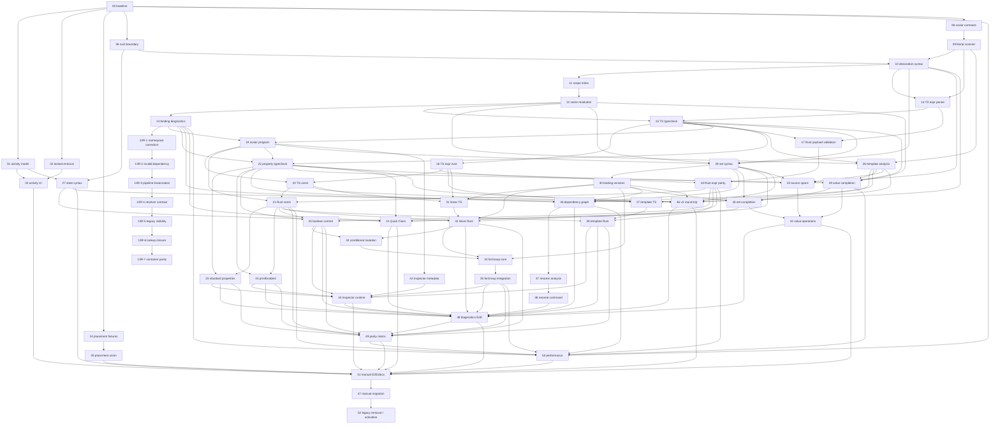

# 型付き変数・レキシカルスコープ実行計画

このdirectoryは[plan.md](plan.md)の仕様を、1 session / 1 branch / 1 PRで実行できる単位へ分割した実装計画である。Task 00〜52とTask 13後の補正Taskから成り、parser、analysis、TS reference、Rust parity、production connection、UI、manual migration、legacy removalを独立完了できる境界から決めた。

## 実行ルール

- 着手前に`plan.md`、`decisions.md`、自task、依存taskの引き継ぎを読む。
- 依存PRがmainへmergeされ、前提APIがmainに存在してからbranchを作る。
- task文書のbranch slugは推奨名。実際のprefixは実装環境/repository運用に従う。
- 1 taskで主責務を増やさない。後続task用の仮production実装を入れない。
- 状態は`未着手 / 進行中 / 完了 / 保留(理由)`。
- 共通gateは`npm test`、`npm run build`、`npm run lint`。Rust/評価taskは文書指定の追加gateも実行する。

## Task 36 performance record

測定日: 2026-07-27。`src/scalars/typedDependencyGraph.performance.test.ts`をfork 1 workerで実行し、`nui 3`の直列typed initializer 250/1000件（各参照は直前bindingへ接続）を対象に、compile時のgraph構築を含むCPU時間を計測した。各サイズ100 warm-up後、21 trialを1 compileずつ測定した。

| bindings / edges | median | p95 |
| --- | ---: | ---: |
| 250 / 249 | 3.093 ms | 3.576 ms |
| 1000 / 999 | 21.842 ms | 22.071 ms |

250→1000 median scaling: 7.061x。queryはこのcompile済みgraphのadjacencyを読むだけで、測定対象・実装ともquery時のsource再parse、name再resolve、graph再構築を行わない。

## Task 37 performance record

測定日: 2026-07-28。`src/scalars/typedRenameAnalysis.performance.test.ts`をfork 1 workerで実行し、`nui 3`の密なtyped fan-out参照(1つのtyped bindingを250/1000件の`let`初期化子が直接参照する)を対象に、compile+`analyzeTypedBindingRenameInDocument`のCPU時間を計測した。各サイズ100 warm-up後、21 trialを1 rename解析ずつ測定した。

| bindings / referencing occurrences | median | p95 |
| --- | ---: | ---: |
| 250 / 250 | 4.141 ms | 6.301 ms |
| 1000 / 1000 | 27.559 ms | 31.790 ms |

250→1000 median scaling: 6.655x。virtual renameは`BindingCatalog.bindings`のshallow copy(対象bindingの`name`のみ置換)であり、`LexicalScopeIndex`の再構築、`compileDslDocument`/`parseDsl`の再実行、source再parseは行わない。before/after双方の解決は`resolveInitializerReferences`/`resolveReferencesAtSites`を文書全体で1回ずつ(occurrence種別ごとにbatch)呼ぶのみで、occurrenceごとの個別呼び出しは行わない。

## Task 39 performance record

測定日: 2026-07-28。`src/scalars/typedValueCandidates.performance.test.ts`をfork 1 workerで実行し、`nui 3`の直列typed number宣言250/1000件+cursor位置の1件(合計251/1001 binding)を対象に、**precomputed `BindingCatalog`/`BindingAnalysis`を1回だけ構築した後**の`typedBindingReferenceCandidates`(`visibleBindingsAt`+invalid除外+型フィルタ)のCPU時間だけを計測した(compileDslDocumentは各サイズにつき1回だけ、測定ループの外で実行)。各サイズ100 warm-up後、21 trial、trialあたり20 runの平均を1サンプルとして計測した。

| bindings (250/1000 + cursor) | median | p95 |
| --- | ---: | ---: |
| 251 | 0.109 ms | 0.192 ms |
| 1001 | 0.488 ms | 0.493 ms |

250→1000 median scaling: 4.484x。measured関数はcatalogの再構築・source再parse・compileを一切行わず、`visibleBindingsAt`の1回のsite走査結果に対する型フィルタ処理だけを計測する。この記録は絶対gateではなくbaselineとして残し、Task 50がCI分散とあわせてgate値を決める。

## タスク一覧

| # | task | domain | depends | connection at completion | branch slug | status |
|---|---|---|---|---|---|---|
| 00 | [baseline compatibility/performance fixtures](tasks/00-baseline-compat-performance-fixtures.md) | test foundation | - | fixtures only | `typed-vars/00-baseline-fixtures` | 完了 |
| 01 | [activity domain/legacy bridge](tasks/01-activity-domain-legacy-bridge.md) | activity | 00 | production internal model | `typed-vars/01-activity-domain` | 完了 |
| 02 | [locked removal](tasks/02-locked-removal.md) | cleanup | 00 | production removal | `typed-vars/02-locked-removal` | 完了 |
| 03 | [activity command/UI](tasks/03-activity-command-ui.md) | command/editor UI | 01,02 | production UI | `typed-vars/03-activity-ui` | 完了 |
| 04 | [DivisionPlacement characterization](tasks/04-division-placement-characterization.md) | compatibility tests | 00 | fixtures only | `typed-vars/04-placement-characterization` | 完了 |
| 05 | [DivisionPlacement union](tasks/05-division-placement-union.md) | model/evaluation | 04 | production refactor | `typed-vars/05-placement-union` | 完了 |
| 06 | [nui 3 version boundary](tasks/06-nui3-version-boundary.md) | DSL/document | 00 | production plumbing; v2 unchanged | `typed-vars/06-nui3-boundary` | 完了 |
| 07 | [nui 3 state syntax](tasks/07-nui3-state-syntax.md) | activity DSL | 01,06 | production v3 syntax | `typed-vars/07-state-syntax` | 完了 |
| 08 | [scalar type contracts](tasks/08-scalar-type-contracts.md) | scalar core | 00 | unconnected library | `typed-vars/08-scalar-contracts` | 完了 |
| 09 | [scalar literal scanner](tasks/09-scalar-literal-scanner.md) | DSL scanner | 08 | unconnected library | `typed-vars/09-literal-scanner` | 完了 |
| 10 | [typed declaration syntax](tasks/10-typed-declaration-syntax.md) | DSL parser/serializer | 06,09 | feature-gated syntax | `typed-vars/10-declaration-syntax` | 完了 |
| 11 | [lexical scope index](tasks/11-lexical-scope-index.md) | binding analysis | 10 | analysis only | `typed-vars/11-scope-index` | 完了 |
| 12 | [binding name resolution](tasks/12-binding-name-resolution.md) | binding analysis | 11 | analysis only | `typed-vars/12-binding-resolution` | 完了 |
| 13 | [binding diagnostics/initializer graph](tasks/13-binding-diagnostics-initializer-graph.md) | diagnostics | 12 | analysis only | `typed-vars/13-binding-diagnostics` | 完了 |
| 13R-1 | [binding resolution / namespace correction](tasks/13r1-resolution-namespace.md) | binding analysis | 13 | analysis only | `typed-vars/13r1-resolution-namespace` | 完了 |
| 13R-2 | [invalid binding dependency propagation](tasks/13r2-invalid-dependency.md) | binding analysis | 13R-1 | analysis only | `typed-vars/13r2-invalid-dependency` | 完了 |
| 13R-3 | [binding pipeline linearization](tasks/13r3-binding-pipeline-linearization.md) | performance | 13R-2 | analysis only | `typed-vars/13r3-binding-pipeline` | 完了 |
| 13R-4 | [batch resolver owner contract / forward order](tasks/13r4-batch-resolver-contract.md) | binding analysis | 13R-3 | analysis only | `typed-vars/13r4-resolver-contract` | 完了 |
| 13R-5 | [legacy visibility lookup linearization](tasks/13r5-legacy-visibility-linearization.md) | performance | 13R-4 | analysis only | `typed-vars/13r5-legacy-visibility` | 完了 |
| 13R-6 | [binding lookup closure](tasks/13r6-binding-lookup-closure.md) | binding analysis/performance | 13R-5 | analysis only | `typed-vars/13r6-binding-lookup-closure` | 完了 |
| 13R-7 | [legacy declaration order / CAD container parity](tasks/13r7-legacy-container-parity.md) | binding analysis/performance | 13R-6 | analysis only | `typed-vars/13r7-legacy-container` | 完了 |
| 14 | [TS expression parser](tasks/14-ts-expression-parser.md) | typed expression | 09,10 | unconnected AST | `typed-vars/14-ts-expression-parser` | 完了 |
| 15 | [TS expression typechecker](tasks/15-ts-expression-typechecker.md) | typed expression | 12,14 | unconnected typecheck | `typed-vars/15-ts-expression-typecheck` | 完了 |
| 16 | [TS expression reference evaluator](tasks/16-ts-expression-reference-evaluator.md) | typed expression | 15 | reference only | `typed-vars/16-ts-expression-eval` | 完了 |
| 17 | [Rust expression payload validation](tasks/17-rust-expression-payload-validation.md) | Rust typed expression | 14,15 | shadow validator | `typed-vars/17-rust-expression-payload` | 完了 |
| 18 | [Rust expression evaluator parity](tasks/18-rust-expression-evaluator-parity.md) | Rust typed expression | 16,17 | shadow parity | `typed-vars/18-rust-expression-eval` | 完了 |
| 19 | [compiled scalar program](tasks/19-compiled-scalar-program.md) | compiler/IPC | 13,15 | feature-gated IR | `typed-vars/19-scalar-program` | 完了 |
| 20 | [TS const evaluation](tasks/20-ts-const-evaluation.md) | reference evaluation | 16,19 | gated reference path | `typed-vars/20-ts-const-eval` | 完了 |
| 21 | [Rust const evaluation parity](tasks/21-rust-const-evaluation-parity.md) | production evaluation | 18,19,20 | gated Rust/shadow path | `typed-vars/21-rust-const-eval` | 完了 |
| 22 | [property reference typecheck](tasks/22-property-reference-typecheck.md) | compiler/parameters | 13,15,19 | analysis only | `typed-vars/22-property-typecheck` | 完了 |
| 23 | [standard property runtime](tasks/23-standard-property-runtime.md) | TS/Rust evaluation | 21,22 | gated runtime | `typed-vars/23-property-runtime` | 完了 |
| 24 | [printEnabled runtime](tasks/24-print-enabled-runtime.md) | print state | 21,22 | gated print runtime | `typed-vars/24-print-enabled` | 完了 |
| 25 | [boolean control-flow runtime](tasks/25-boolean-control-flow-runtime.md) | control flow | 18,21,22 | gated control runtime | `typed-vars/25-boolean-control-flow` | 完了 |
| 26 | [text template analysis](tasks/26-text-template-analysis.md) | template/parser | 09,12,15 | analysis only | `typed-vars/26-template-analysis` | 完了 |
| 27 | [text template TS evaluation](tasks/27-text-template-ts-evaluation.md) | reference evaluation | 16,20,26 | connected to live document (TS-reference only; Rust gated off) | `typed-vars/27-template-ts` | 完了 |
| 28 | [text template Rust parity](tasks/28-text-template-rust-parity.md) | production evaluation | 18,21,27 | gated Rust path | `typed-vars/28-template-rust` | 完了 |
| 29 | [set syntax/resolution](tasks/29-set-syntax-resolution.md) | DSL/binding analysis | 10,12,15,19 | gated analysis | `typed-vars/29-set-syntax` | 完了 |
| 30 | [binding version IR](tasks/30-binding-version-ir.md) | mutation core | 29 | gated IR | `typed-vars/30-binding-versions` | 完了 |
| 31 | [linear mutation TS](tasks/31-linear-mutation-ts.md) | reference mutation | 16,20,30 | TS reference path; linear set documents remain Rust-gated until 32 | `typed-vars/31-linear-mutation-ts` | 完了 |
| 32 | [linear mutation Rust parity](tasks/32-linear-mutation-rust-parity.md) | production mutation | 18,21,30,31 | gated Rust path | `typed-vars/32-linear-mutation-rust` | 完了 |
| 33 | [conditional mutation](tasks/33-conditional-mutation.md) | control mutation | 25,32 | gated TS/Rust path | `typed-vars/33-conditional-mutation` | 完了 |
| 34 | [forGroup mutation core](tasks/34-forgroup-mutation-core.md) | loop mutation | 30,32,33 | unconnected algorithm | `typed-vars/34-forgroup-mutation-core` | 完了 |
| 35 | [forGroup mutation integration](tasks/35-forgroup-mutation-integration.md) | loop production | 34 | gated TS/Rust path | `typed-vars/35-forgroup-mutation` | 完了 |
| 36 | [typed dependency graph](tasks/36-typed-dependency-graph.md) | dependency model | 13,22,26,29,30 | gated analysis | `typed-vars/36-dependency-graph` | 完了 |
| 37 | [typed rename analysis](tasks/37-typed-rename-analysis.md) | rename safety | 36 | gated analysis | `typed-vars/37-rename-analysis` | 完了 |
| 38 | [typed rename command](tasks/38-typed-rename-command.md) | command/text splice | 37 | gated command | `typed-vars/38-rename-command` | 完了 |
| 39 | [typed value completion](tasks/39-typed-value-completion.md) | editor completion | 12,15,22,26 | gated editor | `typed-vars/39-value-completion` | 完了 |
| 40 | [set/recovery completion](tasks/40-set-recovery-completion.md) | editor completion | 29,30,39 | gated editor | `typed-vars/40-set-completion` | 完了 |
| 41 | [typed variable Quick Fixes](tasks/41-typed-variable-quick-fixes.md) | diagnostics/editor | 07,13,22,29,40 | gated editor | `typed-vars/41-quick-fixes` | 完了 |
| 42 | [Inspector declaration metadata](tasks/42-inspector-declaration-metadata.md) | Inspector | 19 | gated UI metadata | `typed-vars/42-inspector-metadata` | 完了 |
| 43 | [Source Editor span/navigation](tasks/43-source-editor-span-navigation.md) | editor | 10,22,26,29 | gated editor API | `typed-vars/43-source-spans` | 完了 |
| 44 | [Source value operations/picker boundaries](tasks/44-source-value-operations.md) | editor interaction | 39,40,43 | gated editor UI | `typed-vars/44-source-value-ops` | 完了 |
| 45 | [Inspector runtime values](tasks/45-inspector-runtime-values.md) | Inspector | 23,24,25,28,35,42 | gated final-value UI | `typed-vars/45-inspector-runtime` | 完了 |
| 46 | [nui 3 serializer/round-trip/patching](tasks/46-v3-serializer-roundtrip-patching.md) | persistence | 07,10,22,26,29,30 | gated nui 3 persistence | `typed-vars/46-v3-roundtrip` | 完了 |
| 47 | [existing document manual nui 3 migration](tasks/47-manual-nui3-migration.md) | migration operations | 51 | verified migrated documents | `typed-vars/47-manual-nui3-migration` | 未着手 |
| 48 | [integrated diagnostics E2E](tasks/48-integrated-diagnostics-e2e.md) | diagnostics hardening | 23,24,25,28,32,35,36,38,41,44,45,46 | gated release check | `typed-vars/48-diagnostics-e2e` | 未着手 |
| 49 | [full TS/Rust parity matrix](tasks/49-full-parity-matrix.md) | parity hardening | 21,23,24,25,28,32,35,48 | release gate | `typed-vars/49-parity-matrix` | 未着手 |
| 50 | [performance regression gates](tasks/50-performance-regression-gates.md) | performance | 00,13,18,21,35,36,39,49 | release gate | `typed-vars/50-performance` | 未着手 |
| 51 | [manual nui 3 E2E/docs](tasks/51-manual-e2e-docs.md) | manual validation/docs | 03,05,07,41,44,45,46,48,49,50 | migration-ready checklist | `typed-vars/51-manual-e2e` | 未着手 |
| 52 | [legacy removal / nui 3-only activation](tasks/52-nui3-typed-variable-activation.md) | removal/activation | 47 | nui 3-only production | `typed-vars/52-nui3-only-activation` | 未着手 |

## 依存グラフ

## Critical path

完了済みのTask 00〜19に続く残りのcritical pathは次のとおり。

`29 → 30 → 31 → 32 → 33 → 34 → 35 → 45 → 48 → 49 → 50 → 51 → 47 → 52`

Task 20/21のconst runtime pathはTask 31/32へ、Task 46のnui 3 persistence pathはTask 30後に並行してTask 48へ合流する。23〜28のproperty/template pathと36〜44のdependency/editor pathもTask 48/51までに合流する。

## 並行可能な作業

- Task 19完了後: 22(property typecheck)、26(template analysis)、42(Inspector metadata)は20と並行/独立に着手可能。
- Task 20完了後: 21(Rust const evaluation parity)に着手可能。
- Task 21・22完了後: 23(standard property runtime)、24(printEnabled runtime)、25(boolean control-flow runtime)に着手可能。
- Task 21後: property runtime、template runtime、set/mutation系を依存範囲内で並行。
- Task 30後: mutation pathとTask 46のnui 3 persistenceを並行。
- Task 35後: dependency/rename、completion/editor、runtime Inspectorを依存範囲内で並行。
- Task 48後: parity、performance、manual E2Eを順に完了し、Task 47の手動migration後だけTask 52へ進む。

## Activation条件

52はTask 47が完了し、次の順序がすべて満たされるまで開始不可。

1. activity、placement、typed evaluation、dependency/editor/UIのTask 01〜45が完了。
2. Task 46でnui 3 serializer・round-trip・production persistence経路が完成。
3. Task 48〜51でnui 3 diagnostics、TS/Rust parity、performance、manual E2Eが完了。
4. Task 47で現存ユーザー文書のinventory、手動nui 3更新、open/compile/evaluate/save/reopen確認が完了。

52でpre-nui 3 parser/importer/serializer/adapter/fallback/bridge/fixtureを削除し、残存legacy分岐がないことを確認してからtyped declaration feature gateを外し、新規document defaultを`nui 3`へ変更する。途中Taskのgated implementationへproduction UIを直接つながない。

## 次に実行可能なtask

40・41・42・43・44・45は完了済み。46(07,10,22,26,29,30もすべて完了済み)は依存関係上独立に着手可能。48はこれで44・45が揃ったが、46・他の依存taskの完了も必要。Task 21/32以降のRust-first `evaluate_document(input)` は、解決済み`scalar_program`または`bindingVersions`を評価し、`computedScalarBindings`をTS payloadへ返す。text templateも同じ解決済みASTを渡し、Rustでsource再parse・名前再解決・legacy fallbackを追加しない。

### Task 22完了時点の引き継ぎ(23〜26向け)

`src/dsl/dslDocument.ts`の`compileDslDocument`は、typed宣言が1件以上ある`nui 3`文書で`scalarAnalysis`が得られた場合、`src/scalars/propertyBindingCompiler.ts`の`compilePropertyBindings`を呼び、結果を`CompiledDslDocument.propertyBindings?: ReadonlyMap<string, ScalarValueSource>`へ格納する(`scalarProgram`/`bindingAnalysis`と同じ並び)。診断は`compiled.diagnostics`へ通常のcompile diagnosticsとして統合済みで、エラーがあれば他のcompile errorと同じく`document: null`(last-good-document維持)になる。

- key形式は`propertyBindingOccurrenceKey(statementIndex, parameterKey)`(`src/scalars/propertyBindingCompiler.ts`からexport)。`parameterKey`はDSL引数名ではなくparameterDefinitionsの`key`(例: `intersectionPoint`の`extensions:`引数は`useExtensions`というkeyになる)。
- `ScalarValueSource`は現状`{kind:"literal"}`(未使用)と`{kind:"binding"; bindingId; type; span; nameSpan; name}`のみ。mapにkeyが存在しない場合はliteral(既存element fieldをそのまま使う)。
- 23(標準property)・24(printEnabled)・25(showGenerated)は、このmapを`bindingId`でTask 21の`computedScalarBindings`と突き合わせてruntime値を得ればよく、sourceの再parse・binding名の再解決は不要。
- 26(text template)は`text.text`が単独`@binding`のケースをこのmapから得られるが、`{...}`interpolation hole自体はTask 22の対象外であり、26が新たに解析する。
- `src/dsl/dslApplyArgs.ts`のboolean引数は`@`始まりの値に対して「true/false で指定してください」診断を出さないよう変更済み(Task 22でのbinding診断と重複させないため)。choice/text引数はもともと未検証だったため変更なし。

### Task 23完了時点の引き継ぎ(24〜25向け)

Task 23で`computedScalarBindings`の生成方式を、文書全体の評価ループが終わった後に一括評価する方式から、**on-demand・memoized resolver**方式へ変更した(TS: `src/scalars/declarationEvaluator.ts`の`createLazyScalarProgramEvaluator`/`finalizeScalarProgramEvaluation`、`src/geometry/scalarProgramEvaluation.ts`の`createDocumentScalarBindingResolver`。Rust: `src-tauri/src/evaluation/scalars/bindings.rs`の`ScalarBindingResolver`)。

- `resolve(bindingId)`はbindingの初期化子を初回参照時にだけ評価し、結果をmemoizeする。legacy var参照は`computedVariables`/`state.computed_variables`を**都度live読み**する(事前snapshot方式ではない)。これにより、評価ループの途中(要素のproperty materialize時)でも安全にbinding値を取得でき、`computedScalarBindings`の最終出力はscalar_programが存在する限り常に生成される(propertyBindingの有無に依存しない)。
- 循環参照はTask 13のcompile時diagnosticで既に排除されているが、defense-in-depthとして`in_progress`ガードを両言語に追加した(TS: 例外throw、Rust: `evaluation-binding-cycle-guard`という`ScalarEvaluation::Error`を返す)。
- `finalize()`/`finalizeScalarProgramEvaluation`は`program.statements`を順に走査してresolverから値を引くため、内部でどんな順序でbindingが解決されても出力mapの順序は不変。
- 24(printEnabled)・25(showGenerated)はこの同じresolver機構(`ScalarBindingResolver`/`createDocumentScalarBindingResolver`)を再利用してよい。それぞれの対象property専用のmaterialize adapter(`src/geometry/propertyBindingRuntime.ts`のような)を新設し、23の`STANDARD_PROPERTY_TARGETS`allowlistへ自分たちのpropertyを追加しないこと(scope越境になる)。
- property runtimeの生産経路は`src/components/AppLayout.tsx`(store `doc.scalarProgram`/`doc.propertyBindings`/`doc.statementMap`/`doc.document.elements`から`buildPropertyBindingRuntimeEntries`で構築)→`src/geometry/useEvaluationEngine.ts`(`propertyBindingEntries`をTS reference/Rust IPC両方へ転送)→`src/geometry/evaluate.ts`/Rust `mod.rs`が実際にmaterializeする、という一直線。24/25もこの同じ経路(AppLayout→useEvaluationEngine→evaluate.ts/mod.rs)に新しいentry種別を足す形で接続できる。
- Rust側のIPC payload形状(`EvaluationInput.property_bindings: Option<Value>`)と、7つの標準propertyペア+正準ScalarTypeを独自に検証する`property_binding_payload.rs`の設計は、24/25が新しいproperty pairを追加する際のテンプレートになる(Rustは常にTS payloadを無条件に信用せず、対象pairと期待型を自前で検証する)。

### Task 24完了時点の引き継ぎ(25/45向け)

Task 24は`group.printEnabled`を、Task 23の`STANDARD_PROPERTY_TARGETS`/`buildPropertyBindingRuntimeEntries`/`materializePropertyBoundElement`(=element clone→`evaluateElement`)経路には接続しなかった。理由: groupは`evaluate.ts`/Rust `evaluate_element_by_type`のどちらでも通常evaluationの対象外(groupを評価してdrawする概念がなく、materializeしても捨てられるだけ)であり、print traversal(`src/print/printGeometry.ts`)自体がTS-onlyでRust側に対応moduleがない。そのためAppLayout→useEvaluationEngine→evaluate.ts/mod.rsの一直線には乗らない。

- 新設した`src/geometry/groupPrintEnabledRuntime.ts`は、Task22で既に生成済みの`doc.propertyBindings`(occurrenceKey付きmap)と`doc.statementMap.byElementId`(elementId→StatementInfo)の**2つの既存lookupをそのまま連結するだけ**で、group.id→bindingIdをO(1)解決する(`resolveGroupPrintEnabledBindingId`)。新しいdocument-wide mapは一切生成しない — `GroupPrintEnabledLookup`はこの2つの既存参照を束ねただけの薄いエイリアス。
- `isGroupPrintEnabled(group, lookup, computedScalarBindings)`は、bindingが無ければ既存のliteral `printEnabled === true`判定にfall backし、boundならTask21が既に生成している`evaluation.computedScalarBindings`(TS/Rust両方で同一shape、`finalize()`で毎回全binding分生成済み)を1回引くだけ。poison/error/型不一致はすべて`false`(print除外)にfail closeする — `errors`/`warnings`へは一切書き込まない(Canvas/通常evaluationに影響しないという固定仕様どおり)。
- 接続点は`src/print/printGeometry.ts`の`printableGroups`/`printableItemsForLayout`/`printablePathsForLayout`(いずれも`groupPrintEnabledLookup`という追加optional引数)と、呼び出し側4箇所(`printSvgExport.ts`、`printPdfExport.ts`、`PrintLayoutView.tsx`の`PrintLayoutCanvas`/`PrintLayoutPanel`、`PrintLayoutPreviewWindow.tsx`)。いずれも既にstoreへ直接アクセスしているため、`state.doc.propertyBindings`/`state.doc.statementMap.byElementId`をそのまま渡すだけで、新しいscan/mapを各call siteで組み立てることはない。
- Rust側は無変更。`computed_scalar_bindings`はscalar_programが存在すれば常に生成される(property binding entriesの有無と無関係)ため、printEnabled解決に必要なRust側の値は既にTask21の時点で揃っている。`property_binding_payload.rs`の`canonical_expected_type`allowlistへ`("group","printEnabled")`を追加する誘い(同ファイルのコメント)には従っていない — これはTask23の標準property経路専用のallowlistであり、printEnabledをそこに混ぜるとgroupが通常evaluationのmaterialize対象になってしまう。
- `src/model/elementPresentationStatus.ts`の`printEnabled`フィールド(source editor gutter class `cm-eval-print-enabled`)はliteralのみのまま未着手。Task 24の引き継ぎどおりTask 45(Inspector runtime values)の対象。
- `toggleGroupPrintEnabled`/`toggleSelectedGroupPrintEnabled`(`src/commands/selectionCommands.ts`)は無変更 — bound printEnabledをliteralで上書きしてしまう。ただし他6つのopt-inプロパティにも同種のwrite-guardは存在せず、これはTask24固有の新規gapではない。
- 25(forGroup.showGenerated)はcontrol-flowそのもの(iteration実行有無)を左右するため、printEnabledと同じ「print-onlyの外付けlookup」パターンは使えない可能性が高い — showGeneratedは通常evaluationの内側(AppLayout→useEvaluationEngine→evaluate.ts/mod.rs)に接続する必要があるかどうか、25着手時に個別に見極めること。

### Task 25完了時点の引き継ぎ(26/29/33向け)

`conditionalGroup.condition`と`forGroup.showGenerated`にtyped booleanを接続した。2つは互いに全く異なる形で既存機構へ接続している — 後続taskがproperty/condition接続を追加する際は、対象が「単独`@name` binding」か「任意の式」かをまず見極めること。

- **showGenerated**は単独`@name` binding — Task22の`compilePropertyBindings`が既にコンパイル済みで、Task25はconstructionを一切増やしていない。`src/geometry/controlBooleanRuntime.ts`の`buildControlBooleanRuntimeEntries`(Task23の`buildPropertyBindingRuntimeEntries`と同型・独立allowlist)が`doc.propertyBindings`を再利用するだけ。Rustは`control_boolean_payload.rs`(`property_binding_payload.rs`と同型、1エントリのcanonical allowlist)。
- **condition**は`if (...)`全体が任意のtyped boolean式であり、単独`@name`ではない — Task22の`propertyBindingCompiler.ts`(`SCALAR_ELIGIBLE_PARAMETER_KINDS`が`number`を除外)では表現できないため、新規`src/scalars/conditionalGroupConditionCompiler.ts`を追加した。ここが唯一の新しい判定ロジック:legacy numeric grammar(`numericExpressionParser.ts`)は比較・`&&`/`||`も既に扱えるため、"parseできるか"では分類できない。実装した分類規則は`docs/typed-variables/README.md`の姉妹文書ではなくplan本体になく、`conditionalGroupConditionCompiler.ts`冒頭コメントとPR本体に明記: (1) `booleanLiteral`/`stringLiteral`/unary`!`がtree中に1つでもあれば無条件でtyped候補、(2) それ以外は式中の全`@name`参照が`declaredType===null`(legacy var)ならlegacy-eligible(0参照も含む)、(3) それ以外はtyped候補とし、typed候補内の各参照を個別診断(未解決/legacy参照混在/無効宣言)してからTask15の`typecheckScalarExpression(expectedType:boolean)`を呼ぶ。コンパイル結果は`doc.propertyBindings`とは別の`CompiledDslDocument.conditionalGroupConditions: ReadonlyMap<occurrenceKey, TypedScalarExpression>`(値がbindingIdでなく式ASTそのもの)。Rustは`condition_expression_payload.rs`(Task17の`validate_typed_expression_payload`を再利用し、要素typeが`conditionalGroup`であること・root型がbooleanであることを自前検証)。
- 両者ともruntime解決は`src/geometry/controlBooleanRuntime.ts`の`resolveConditionalGroupBranch`/`resolveForGroupEffectiveShowGenerated`(Rust: `control_boolean_runtime.rs`)——Task21の`ScalarBindingResolver`をそのまま渡すだけで新しいresolverは作らない。`evaluate.ts`/`mod.rs`とも、bound判定は「template/sourceElement側のid」で行う(forGroup生成clone対応、Task23の`template_id`規約と同一)。
- **forGroup展開のparentGroupId remapバグを本task中に発見・修正した**(Task25固有ではなく既存の汎用バグ): `src/geometry/forGroupExpansion.ts`の`expandForGroupIteration`は、生成clone の`parentGroupId`を`idMap`経由で remapしていなかった(`remapElementReferences`は型別のreference field しか触らず、`parentGroupId`はcaller側で無変換のまま代入されていた)。forGroup本体直下の子要素は元々OKだったが、forGroup template内に`conditionalGroup`(や`group`)がネストしその子がさらにいる場合、孫要素の`parentGroupId`が「そのiterationでcloneされた親」ではなく「共有の元id」を指したままになり、`inactiveConditionalGroupId`の親探索が壊れていた。Rust `for_group.rs`は`remap_json_ids`がJSON全体を汎用的に文字列置換するため元々この問題がなく、修正はTS側のみ。今後forGroup+ネストcontainerを扱うtaskはこの修正を前提にしてよい(`src/geometry/forGroupExpansion.test.ts`と新規`controlBooleanRuntimeIntegration.test.ts`のforGroup-templateケースで担保)。
- 26(text template)がbinding以外の式を扱う場合、上記のcondition側パターン(専用compiler + 別mapを`CompiledDslDocument`へ追加)を参考にできる。29(set構文)も同様に、単独binding/式全体のどちらを対象にするか最初に見極めること。

### Task 26完了時点の引き継ぎ(27/28/36/39/43向け)

`label(text: "...")`のraw quoted値をescape/hole delimiter両方について**1回のforward scanだけ**で解析する。二重scanを避けるため、`src/scalars/literalScanner.ts`の`STRING_ESCAPES`テーブルをexportし、Task09の`scanStringLiteral`とは別に`src/scalars/textTemplateScan.ts`の`scanTextTemplateLiteral`が同じテーブルを使って独自のフラットな1ループで文字列escapeとhole brace(`{`/`}`)を同時に確定する(`scanScalarLiteral`を呼んでから`raw`をもう一度歩く、という二段構えにはしていない)。escape検出は常にbrace検出より先に評価されるため、`\{`/`\}`はどの位置でも(hole content内でも)literal escapeとして扱われ、hole delimiterと衝突しない。

- **raw/cooked位置対応**: `TextTemplateAst`の各`literal`segmentは`span`(raw)に加え`cookedRange`(そのtemplate全体の「cooked座標系」でのoffset範囲)と`cooked`を持つ。各`hole`segmentは静的長を持たない(値は評価時にしか決まらない)ため、代わりに`cookedInsertOffset`(そのcooked座標系での挿入位置、単一点)を持つ。cooked座標系はholeを幅0として数えるという明確な取り決めで、27/43はraw/cooked間の対応を再scanなしで得られる。
- **hole分類**は25の`conditionalGroupConditionCompiler.ts`と全く同じ判定パターンを、conditionではなくhole単位で適用する(共通部分`containsLegacyIncompatibleSyntax`/`isDefiniteLegacyReference`/`unresolvedReferenceMessage`は`typedDeclarationAnalysis.ts`へ`collectReferences`と並べて共通化し、25側もそちらを参照するよう更新した): `parseScalarExpression`が失敗する構文(`.property`、関数呼び出し、bare identifierなど)は無条件でlegacy hole(raw文字列のまま、診断なし)。parseできても、typed-onlyな構文(string/boolean literal、unary `!`)を含まずかつ全参照が`declaredType===null`のlegacy varならlegacy hole。それ以外はtyped candidateとして参照ごとに未解決/legacy参照混在/無効宣言を診断してから`typecheckScalarExpression(expectedType:null)`で型推論し、`string`→`TextTemplateStringHoleSegment`、`number`→`TextTemplateNumberHoleSegment`、`boolean`/`choice`(またはnull)→`interpolation-type-mismatch`。
- **典型的なnumeric interpolation済みhole**(`{line.length}`、`{2+3}`、`{@legacyVar}`)は診断なしでlegacy holeへ分類され続ける — Task27/28が今のregex based`resolveTextReferences`/`extractTextReferences`を差し替えるまで、既存文書のtext evaluation semanticsは一切変わらない。
- **`bindingAnalysis`は必須ではない**: `compileTextTemplates`は`versionValidation.majorVersion === 3`だけをgateにする(`scalarAnalysis`の有無では止めない)。typed宣言が1つもない文書でも`label(text:...)`は毎回brace/escape/legacy分類までscanされる — `bindingAnalysis`が渡らない場合、reference-bearingなplain holeは(そのdocumentにtyped bindingが存在し得ないため)無条件でlegacy扱いにfall backし、typed-onlyな構文(`{true}`など)だけがtypecheckされ、その中の参照は解決不能として`text-template-hole-unresolved`でfail closeする。この契約は`src/scalars/textTemplate.test.ts`の"characterization: analyzeTypedDeclarations produces no analysis for a nui 3 doc with zero typed declarations"と`src/dsl/dslDocument.test.ts`の"still compiles textTemplates for a document with no typed declaration at all, unlike propertyBindings/bindingAnalysis"で実測確認済み(推測でgateしていない)。
- **依存情報**: 各typed holeが実際に解決した参照は、hole segment自身の`expression: TypedScalarExpression`(bindingId/型/spanを木構造のまま保持)に加えて、`TextTemplateAst.dependencies: readonly TextTemplateDependency[]`という**平坦化済み配列**(`{holeSpan, bindingId, name, span}`)としても出力する。Task13の`InitializerReference`と同じ発想で、Task36はこの配列を読むだけでdependency edgeを作れ、AST再走査もbinding再解決も不要。legacy holeは寄与しない(そのruntime依存は既存の`extractTextReferences`が別途担当)。
- 接続点は`CompiledDslDocument.textTemplates?: ReadonlyMap<string, TextTemplateAst>`(`src/dsl/dslDocument.ts`)、keyは22と同じ`propertyBindingOccurrenceKey(statementIndex, "text")`。canonical判定は`statement.kind==="element" && statement.type==="text"`(`label`だけが`CadElementType "text"`を生成する)。`attr.value.startsWith("@")`(bare `@binding`)は22の`propertyBindings`領域として26ではスキップする。
- Rust/評価には一切触れていない(対象外)。既存の`resolveTextReferences`/`extractTextReferences`/`evaluateTextElement`/`src/model/dependencies.ts`のtext caseは無変更。27がTS evaluationで`TextTemplateAst`を実際に文字列へ組み立てる際にこのcooked座標系・legacy hole・dependency配列を使う。

### Task 27完了時点の引き継ぎ(28向け)

Task 26の`TextTemplateAst`をTS reference評価へ接続し、AppLayoutの生きた文書からも実際にこの経路を通す(当初計画は評価器のみだったが、ユーザー指示でproduction wiringをこのtaskへ含めた)。Rust IPC payload・Rust evaluatorは一切変更していない。

- **pure評価器**は`src/scalars/textTemplateEvaluator.ts`の`evaluateTextTemplate(ast, scalarEnvironment, evaluateLegacyHole, formatNumber)`。geometryに一切依存しない — legacy holeの評価とnumber formatは呼び出し側からinjectする関数として渡す(`src/scalars/`のfile-org方針どおり)。segmentsをsource順に1回だけ走査し、**最初に失敗したhole**でfail closeする(旧regex実装の「firstErrorという名前だが実際は最後の失敗が勝つ」という挙動とは意図的に異なる — 複数holeが同時に失敗する場合にだけ観測される差分)。
- **geometry adapter**は`src/geometry/textTemplateRuntime.ts`。3つの責務: (1) `buildTextTemplateEntriesByElementId`(statementIndex-keyed`textTemplates`→elementId-keyed、Task25の`buildConditionalGroupConditionsByElementId`と同型、**scalarProgramのgateなし** — `compileTextTemplates`はtyped宣言0件のnui3文書でも毎回走るため)。(2) `TEXT_PROPERTY_TARGETS = { text: ["text"] }`という**このtask専用の新しいallowlist**(`text.text`の裸`@binding`ケース、Task23の`STANDARD_PROPERTY_TARGETS`へ混ぜることは`propertyBindingRuntime.ts`のコメントで明示的に禁止されている)+`buildTextPropertyBindingRuntimeEntries`。(3) `evaluateElementTextTemplate`(1要素分のAST評価。legacy holeは`normalizeNumericExpressionInput`+`evaluateNumericValue`+`textNumber`という、旧`resolveTextReferences`が1マッチごとに行っていたのと全く同じpipelineを、hole単位に切り出して再利用する)。
- **`textNumber`を`src/geometry/numericExpressions.ts`でexport化**した(旧`const`→`export const`)。typed number holeとlegacy holeの両方がこの1つの関数でformatされる — 整数はそのまま、非整数は`toFixed(3)`してtrailing zero除去、という固定仕様は1箇所だけに残る。
- **`ElementEvaluationContext`**(`src/geometry/elementEvaluatorTypes.ts`)に`textTemplate?: TextTemplateAst`と`resolveScalarBinding?`を追加。`src/geometry/textEvaluator.ts`は`context.textTemplate`が存在すれば**常に**AST経路を使い、旧`resolveTextReferences`へは絶対にfall backしない — typed string literalのescape処理は`\{`/`\}`を格納前に生のbraceへ戻してしまうため、cooked済みの`element.text`に対して旧regexを再度走らせると、意図的にescapeされた`{5}`をholeとして誤認識する(本taskが解決した実際のcorrectnessバグ)。
- **`evaluate.ts`**に`textTemplateEntriesByElementId`(scalarProgram不要)と`textPropertyBindingEntries`(`propertyBindingEntries`/`controlBooleanEntries`と同じ「scalarProgramなしなら投げる」guard付き)を追加。フェイルラウドな`resolveScalarBindingForText`フォールバック(scalarProgramが無いのにtyped holeに遭遇したら例外)は、"typed holeが存在するならtyped宣言がありscalarProgramもある"という不変条件が破られた場合のためのdefensive throw。
- **production wiring**: `AppLayout.tsx`は`state.doc.textTemplates`を他の`doc.*`フィールドと同じ場所で読み、`textTemplateEntriesByElementId`/`textPropertyBindingEntries`を他3つのentry builderと並ぶ`useMemo`で構築して`evaluationOptions`へ足す(文書更新時にだけ再構築、render/evaluationごとの再scanなし)。`useEvaluationEngine.ts`はこの2フィールドを内部の`evaluationOptions`memoと`requestKey`(Mapは`Array.from`)の両方へ通す。**Rust IPC(`evaluateElementsWithRust`の`invoke`payload、`EvaluateDocumentInput`型)へは一切追加していない** — Rustはこの2フィールドの存在を知らないまま。
- **Rust-eligibility gate**: `text`は元々`rustSupportedElementTypes`に含まれておらず、text要素を含む文書は既に常に`rustEligible=false`だった。それでも`evaluationEngine.ts`に`hasUnsupportedTypedTextContent`という明示的なチェックを追加した(`textTemplateHasTypedHole`+`textPropertyBindingEntries`の`elementId`集合を見る) — 将来`text`へbaseline(legacy-onlyの)Rust対応が28より先に入っても、typed hole/裸bindingを持つ文書だけは引き続きTS referenceへ固定されるようにするための、意図的な冗長ガード。`canUseRustEvaluationForElements`の`.every()`が偽になれば`useEvaluationEngine.ts`はどのmodeでも(`reference`/`parity`/`shadow`/`rust`)Rustを一切呼ばず`referenceEvaluation`だけを使うため、parity/shadow modeで未対応Rust結果を採用してしまう経路も存在しない。

### Task 28完了時点の引き継ぎ(45/48/49向け)

RustはTS compile済み`TextTemplateAst`だけを評価する。`textTemplates`はliteral/legacy hole/typed ASTの縮小payload、`textPropertyBindings`は`text.text`専用allowlistであり、どちらもsource scan・parse・名前解決を行わない。

- payload validationはtemplate owner/type、重複ID、segment shape、typed hole root typeをfail-closedで検証する。typed holeは`scalarProgram`または`bindingVersions`がある場合だけ受理し、bare `text.text` bindingはstring型かつ既知binding IDだけを受理する。
- Rust evaluatorは`ScalarDocumentBindingResolver`を通すため、declaration-only・set mutation・conditional mutation・forGroup iteration-local bindingのいずれでも現行slotを読む。forGroup generated/nested textはtemplate element IDでcompiled templateを検索する。
- `text`はnui 3のcompiled templateまたはbare binding entryを持つ場合だけRust eligible。v2 textにはentryが生成されないため、従来のTS経路を維持する。
- `textPropertyBindings`はvalidation後に既存property materializationへ合流し、別のlegacy adapterやfallbackは設けない。Task 45/48/49はtext geometry/errorとbinding historyをこの経路のまま検証できる。

### Task 29完了時点の引き継ぎ(30/40/43向け)

`set name = expression`の独立parser/serializer/target解決/RHS typecheckを実装し、`declaration parser`(`src/dsl/dslDeclarationParser.ts`)には一切触れていない。新規`kind: "set"`は`nonElementKinds`に含め、CadElement化・duplicate name検査には参加しない。

- **parser/serializer**: `src/dsl/dslSetParser.ts`の`parseDslSetStatement`(`set NAME = EXPRESSION`のみ、型注釈なし)と`src/dsl/dslSetSerializer.ts`の`serializeSetStatement`(`typedDeclaration`と同じく、RHSはraw textをbyte-for-byteで再emit、再quote/re-escapeしない)。`dslParser.ts`の`dslStatementKeywords`/独立`setKeywords`/`parseLine`分岐/`nonElementKinds`へ登録済み。version gateは`dslCompiler.ts`の`setStatementVersionDiagnostics`(`typedDeclarationVersionDiagnostics`と同じ`requireDslMajorVersionForFeature`経由)。
- **statement identity(30が必ず使う契約)**: `src/document/statementReconciler.ts`の`isIdentityStatement`/`identityKindOf`/`createStatementId`を`"set"`にも拡張し、`typedDeclaration`と全く同じ仕組みで各`set`文へ実行間で安定な`StatementIdentity`を割り当てる。`compileDslDocument`(`dslDocument.ts`)は`hasTypedDeclarations`ゲートを`hasSetStatements`も含む形へ拡張し、`stableStatementIdByIndex`は常に呼び出し側の実reconciler出力(`options.assignedStatementIds`)から構築する — `?? new Map()`のようなfallback空mapや、`statementIndex`からの即席ID生成は一切行わない。`compileSetStatements`(`src/scalars/setStatementCompiler.ts`)自身も`typedDeclarationAnalysis.ts`の`missingIdentity`チェックと全く同じ形で、対象statementに`stableStatementIdByIndex`のエントリが無ければ`missing-stable-statement-identity`でfail-closedし、analysis entryを一切作らない(捏造IDなし)。この二重の保証(呼び出し側のgate + 関数自身のcontract check)により、`SetStatementAnalysis.statementId`は常に本物のreconciler-issued値であることが保証される。`src/scalars/setStatementCompiler.integration.test.ts`が`compileCanonicalText`(実際に`reconcileStatements`を経由する唯一の本番相当経路)を使い、通常compile・無関係な編集後・RHS編集後の3パターンで`statementId`が実在し安定であることを固定している。
- **target解決**: `resolveReferencesAtSites`(Task12、`propertyBindingCompiler.ts`と同じ関数)を、文書全体を1回のforEachで走査してtarget名+RHS参照すべてを1つの`requests`配列へ集約し、**文書全体で1回だけ**呼ぶ(`propertyBindingCompiler.ts`と同じ二段階shape)。`conditionalGroupConditionCompiler.ts`のようにstatementごとに`resolveReferencesAtSites`を呼ぶ設計は採用していない — `resolveReferencesAtSites`の内部`runSweep`は呼び出しごとに文書全体をforward sweepするため、set文ごとに呼ぶとO(文書サイズ×set数)になり線形性が崩れる。
- **診断code**: `CONST_ASSIGNMENT_CODE = "const-assignment"`(target が const)、`INVALID_SET_TARGET_CODE = "invalid-set-target"`(target が undefined/forward/duplicate/legacy/iteration/elementLocal、またはcatalogが存在しない、または宣言型自体が未確定)、`MISSING_SET_STATEMENT_IDENTITY_CODE`(上記identity contract違反)は`plan.md`の固定diagnostic一覧と一致させた。RHS内の参照解決失敗は**target自体とは別code**の`SET_RHS_UNRESOLVED_CODE`/`SET_RHS_INVALID_REFERENCE_CODE`を使う(`propertyBindingCompiler.ts`/`conditionalGroupConditionCompiler.ts`が各consumer専用codeを持つのと同じ理由 — targetとRHS中の参照は構造的に別の失敗モード)。RHS型不一致は`typecheckScalarExpression`自身のcode(`scalar-type-mismatch`/`invalid-choice-literal`)をそのまま透過させる(declaration initializerと同じ扱い、`conditionalGroupConditionCompiler.ts`のような専用codeへの詰め替えはしていない)。
- **invalid letのrecovery rule(このtaskの核心、2種類を区別すること)**: targetが`resolved`かつ`mutability === "let"`のとき、`bindingAnalysis.entriesById`の`status.kind === "invalid"`だけでは拒否しない — **ただし`binding.declaredType !== null`のときに限る**。(a) 自身のinitializer失敗や依存先の失敗で`invalid`になった`let`(型は既知)は正常なrecovery targetとして受理し、analysis entryを作りRHSをその宣言型でtypecheckする。(b) `declaredType`自体が`null`(型注釈が未解決/不正)の`let`は、`entriesById`のstatusに関わらず常に`invalid-set-target`でfail-closedにする — 型が分からなければRHSを安全にtypecheckできないため。現行pipelineでは(b)は実質到達不能(型注釈が壊れていればTask10の時点でdocument-level errorになりscalarAnalysis自体が存在しない)が、`Binding.declaredType: ScalarType | null`は無条件にnullableな型であり、コードはこれを非null前提で扱わない — `typecheckScalarExpression`の`expectedType`へ`binding.declaredType`を渡す直前に必ずnullチェックを通す。`setStatementCompiler.test.ts`の"two distinct invalid-let categories" describeブロックがこの(a)(b)を別テストとして固定しており、(b)は実DSL経由では再現できないため、実binding analysisから対象bindingだけを`declaredType: null`へ差し替えた合成fixture(`withPatchedBinding`、identityベースのdeep replaceヘルパー)で検証している。
- **`CompiledDslDocument.setStatements?: ReadonlyMap<number, SetStatementAnalysis>`**: `propertyBindings`/`conditionalGroupConditions`のような`propertyBindingOccurrenceKey`文字列keyではなく、素の`statementIndex`(number)でkeyする — `set`文は1文につきtargetが1つだけであり、複数属性を区別する必要がある他のmapとは事情が異なる。`textTemplates`と同じく`scalarAnalysis`の有無ではなく`hasSetStatements && majorVersion===3`でgateする(catalogが無くてもinvalid-set-targetの診断は出す必要があるため)。`SetStatementAnalysis`は`{statementId, sourceOrder, scopeId, targetBindingId, targetName, targetSpan, expressionSpan, expression: TypedScalarExpression}`を持つ — version/old-current-value/runtime mutationは一切含まない(Task30の担当)。`src/scalars/scalarProgram.ts`の`ScalarProgramStatement`は`{kind:"declare"}`のみのまま変更していない — plan.mdが示す`{kind:"set",...}`union memberはTask30が別のversion-aware IRとして構築する対象であり、Task19のprogramへ混ぜ込む対象ではない。
- 30は`SetStatementAnalysis.statementId`をversion IDの安定な導出元として直接使える。40/43は`targetSpan`/`expressionSpan`/`targetBindingId`をそのまま再利用でき、source再parse・再resolutionは不要。

### Task 30完了時点の引き継ぎ(31/32/34/36/40向け)

`CompiledDslDocument.bindingVersions`は、valid declarationの`scalarProgram` initializerと、analysis上recover可能なinvalid `let`のpoison version 0、および解決済みvalid `setStatements`だけから構築する。invalid declaration/dependencyの`let`も同一binding chainへ入るため、31は`initialState.kind === "poisoned"`を初期値として扱い、後続setで回復できる。declared typeがない宣言、invalid set、legacy bindingは含まれない。

- `readBindingVersionAtPosition(graph, bindingId, beforeStatement(sourceOrder) | afterStatement(sourceOrder))`が公開queryである。set RHSは`beforeStatement(set.sourceOrder)`、set完了後は`afterStatement(set.sourceOrder)`を使う。lookupはbinding別のsource-order indexを二分探索し、chainを走査しない。
- 各versionの`control`はopaque scope IDをparseせず、`LexicalScopeIndex`から正規化したowner chainを保持する。31/34はbranch merge/loop carryを実装するまでこのmetadataを読むだけとし、再探索やplaceholder ownerを作らない。

### Task 32完了時点の引き継ぎ(33/34/35/45/48/49向け)

linear `set` を含む nui 3 文書は、TS が `BindingVersionGraph` から組み立てる `bindingVersions` payload を通じて Rust-first evaluation へ接続済みである。Rust は source を再parseせず、名前解決・stable ID生成・version再構築もしない。

- payload は version/statement/binding/target/predecessor ID、source order、typed AST、type、initial poison state、control metadata、element source position、`@stop` cutoff を含む。unknown/duplicate ID、不整合 predecessor/target/type/choice/source order、非linear control owner は command boundary で fail-closed になる。linear でない mutation graph は Rust eligibility を得ず TS reference に残る。
- Rust mutation resolver は source order を一度だけ進み、binding current slot を in-place 更新する。set RHS は更新前 slot と live legacy geometry result を読み、poison version は current slot へ書き込まれ、後続setで回復できる。document終端では同じcursorをfinalizeするため、最終element後またはelementなしのlinear setも cutoff 前なら final result/history に反映される。
- `computedScalarBindings` は declaration source order、`computedScalarBindingVersions` は実行済みversion source order を返す。cutoff以上のversionはfinalizeでも評価・history出力されない。setなし文書はTask 21の`scalarProgram` resolver/output pathを維持する。
- Task 33以降は conditional ownerをlinearへ落とさず、branch merge/loop carry専用のpayload/evaluatorを追加すること。Task 45はこのhistoryとfinal binding mapをread-only runtime表示に利用できる。

### Task 33完了時点の引き継ぎ(34/35/45/48/49向け)

conditional mutation は Task 25 の runtime condition result と Task 30 の owner chain だけで実行する。TS/Rust は同じ compiled control/version payload を受け取るが、branch selection は共有しない。各 runtime は conditional opener の `beforeStatement` まで cursor を進め、その current slot と live legacy result で Task 25 condition を一度だけ評価して、stable owner statement ID に `then` / `else` / `null` を登録する。

- active owner chain の version だけが slot を更新する。inactive branch は `inactive-control` history を残すだけで、poison、runtime error、slot 更新を発生させない。condition error/poison/非boolean は Task 25 と同じ `null` で両 branch を inactive にする。
- conditional branch-local declaration は active branch frame に所属し、Task 30 の明示的 scope exit metadata で退役する。退役後は current lookup/final map に現れない。outer binding ID を target にした active set は frame に所属せず、branch 後にも carry する。
- Rust payload は stable conditional owner ID、対応 conditional element ID、branch/scope/parent owner chain metadata だけを渡す。source text、binding 名、TS の branch result は渡さない。unknown owner、owner-chain 不整合、branch metadata 不整合は Rust command boundary で fail-closed。forGroup owner を含む mutation は引き続き Rust eligibility を得ない。

### Task 34完了時点の引き継ぎ(35/45/48/49向け)

`src/scalars/forGroupMutationCore.ts` と Rust `scalars/for_group_mutation_core.rs` は production 未接続の scalar-only loop runner である。既存の forGroup expansion、generated ID/row、evaluation mask、IPC payload、Rust eligibility、`evaluate_document` はこの task では無変更である。

- caller は Task 29/30 が既に発行した opaque な binding/version/statement identity と generated statement mapping を `ForGroupMutationPlan` と body callback に渡す。core は ID/version ID を新規生成・再解決しない。Task 35 は template expansion が確定した generated statement を callback へ順に渡すだけでよい。
- runner は iteration ごとに fresh frame を enter/leave する。frame は read-only number の iteration binding、同 iteration の local declarations、outer slot を lookup し、local は leave 時（callback error 時を含む）に退役する。outer `let` への set は shared slot map を in-place 更新するため、次 iteration と loop 後へ carry する。iteration binding set は明示拒否する。
- callback は nested conditional では Task 33 と同じ active-branch-only rule を適用し、nested forGroup は同じ environment の `run` を再入する。inactive branch は callback/slot write/poison を起こさない。core 自身は geometry や condition expression を評価しない。
- shared fixture `test/fixtures/scalars/for_group_mutation_core.json` を TS/Rust の pure tests が読む。Task 35 はこの contract を維持したまま、generated IDs/rows/masks、enabled/inactive loop、showGenerated、evaluation limit を既存 forGroup runtime 側で統合する。

### Task 35完了時点の引き継ぎ(45/48/49/50向け)

canonicalなforGroup owner graphは、nested conditional、nested forGroup、両者を混在させたowner chainを含んでもRust production schedulerで実行する。Rust eligibilityから除外するのは、compiled element-owner joinの欠落・重複・不整合、またはpayload validationで検出されるmalformed metadataだけである。setなしforGroupとforGroupを持たないmutationの既存eligibilityは変更しない。

- schedulerはiteration-local conditional result stackを持つ。各iterationでbranch結果をresetし、nested runnerは独自のstack entryをpush/popするため、前iterationやouter loopのbranchが漏れない。outer slotはshared environmentでcarryし、loop/branch localはframe leaveで退役する。
- nested generated forGroupは、generated instance IDとoriginal template IDを分けて展開する。outer schedulerはinner openerだけを担当し、inner descendantsはinner schedulerだけが評価する。inner `Stopped` はTask 34 coreからouter callbackまで伝播し、remaining inner/outer iterationを止める。
- production integrationはnormal Rust pathでnested conditional + nested forGroupのRust結果採用を確認し、Rust command testはinner exitでのstop伝播を確認する。`for_group_nested_mutation.nui` はこのcanonical graphのTS/Rust shadow parity fixtureである。

#### Task 35 forGroup mutation 測定記録（2026-07-27）

| runtime | 250 rows median / p95 | 1000 rows median / p95 | 250→1000 | Task 34 coreとの差（median / p95） |
| --- | --- | --- | --- | --- |
| TS core | 0.0258 / 0.1416 ms | 0.1026 / 0.2686 ms | 3.98x | baseline |
| TS production scheduler | 1.3734 / 2.4058 ms | 14.8206 / 15.3438 ms | 10.79x | +1.3476 / +2.2642 ms (250), +14.7180 / +15.0752 ms (1000) |
| Rust core | 0.272959 / 0.274917 ms | 1.085958 / 1.133625 ms | 3.98x | baseline |
| Rust production scheduler | 16.016750 / 16.181875 ms | 122.401375 / 122.850500 ms | 7.64x | +15.743791 / +15.906958 ms (250), +121.315417 / +121.716875 ms (1000) |

TSはVitest fork single worker・file parallelなし、20 warm-up、21 trials、trialあたり5 runsのworker CPU時間で測定した。Rustは`cargo test ... --ignored --nocapture --test-threads=1`、debug test profile、5 warm-up、21 trials、trialあたり1 evaluationのwall timeで測定した。いずれも1 binding、1 generated point template、in-place `set total`を含む250/1000 generated rowsであり、Task 34 coreとの差は同一測定条件のscalar-only core baselineとの差分である。Task 50がこのbaselineとCI分散を使って回帰gateを決める。

### Task 38完了時点の引き継ぎ(41/43/44/48向け)

`renameTypedBindingWithPropagation(bindingId, newName)`(`src/commands/renameTypedBindingWithPropagation.ts`)は、37の"ok" verdictとexact spansだけからatomicにsource patchを行うcommandである。既存element rename command(`renameElementWithPropagation.ts`)とflush/analyze/atomic-reject/1 Undoの境界は完全に共通だが、typed bindingはCadElementではないため、element-model-diff経路(`commitDocumentChange`/`buildTextPatch`)は使わない。

- **37の公開型を1 field拡張した**: `TypedRenameSpan`に`statementIndex: number`を追加した(`occurrence.site.statementIndex`をそのまま転記するだけで、新しい解析・再解決は一切行っていない)。37の"ok" verdict単独ではspanをどの`compiled.statements[i]`にも逆引きできない欠落があり(statement-local logical offsetが複数statement間で衝突しうるため)、37自身の完了条件("38がverdictとexact spansだけでatomic patch可能")を文字通り満たすために必要な最小限の追加。
- **spliceは`LineSplice`(1-based, whole-line replace)であり、生のchar-offset splicingではない**: 新設`src/document/typedRenameSplice.ts`の`buildTypedRenameSplices(sourceText, compiled, entries)`が、37のstatement-local spanを`parseDslSnapshot`(1回だけ)+`physicalSpanForLogicalRange`(`src/dsl/logicalStatementSourceMap.ts`、「the only bridge from parser logical offsets to editor physical offsets」)で物理offsetへ投影し、同一物理行上の複数occurrenceを1つの`LineSplice`へ統合する。適用前に全entryについて`sourceText.slice(from,to) === oldName`を検証し、重複・overlap・非連続projection・行またぎのどれか1件でもあればbatch全体をatomicに`{ok:false}`で拒否する(部分適用なし)。
- **`commitText`ではなく新設`commitLineSplices`store actionを使う**: `commitText`が発行する`sourceUpdate.kind`は`"reset"`(`upgradeDslMajorVersion`と同じ)であり、Source Editor側は行番号だけでcursorを復元し列位置とtext長差分のoffset補正を失う。既存`commitDocumentChange`/`commitModelBridge`が使う`"model-patch"`タグ(CM6 changesetによる`selectionAfterModelPatch`の正確なselection mapping)を再利用するため、`src/document/canonicalDocument.ts`に`commitLineSplicePatch(current, splices)`(element diffなしで`applyLineSplices`+既存`compileCanonicalText`を呼ぶだけ)を追加し、`cadDocumentStore.ts`にそれを`"model-patch"`としてbookkeepingする薄いaction `commitLineSplices`を追加した。既存`sourceEditorController.ts`の`apply-model-patch`経路は無変更のまま再利用している(`src/editor/sourceEditorController.typedRename.test.ts`でCM選択のoffset補正・reject時無変更・undo/redo復元を実測確認済み)。
- **F2・shortcut・UIは意図的に未接続**: 37の"declaration/reference/set/template/property patches、selection/focus restoration、Undo"という対象どおり、command層のみを実装した。palette登録・shortcut・dialogは後続task(43 Source Editor span/navigation、44 value operations等、UIに触れるtask)の対象。既存element rename(F2、`editorTransaction` owner)は無変更。
- 41(Quick Fixes)・43/44(editor span/value ops)・48(diagnostics E2E)は、このcommandをcallする側(UI/quick-fix実装)を追加する形で接続できる。commandのcollision/captureの日本語errorメッセージ(`same-scope-collision`は衝突先binding名のみ、`capture`はoccurrence名のみ — 37の型に行番号が含まれないため、element rename版のような「N行目」表記は持たない)は、後続UIで表示する際そのまま再利用してよい。

### Task 39完了時点の引き継ぎ(40/41/44/50向け)

typed declaration initializer / opt-in scalar property値 / template holeの3箇所に、既存のprecomputed `BindingCatalog`/`BindingAnalysis`を読むだけの値補完を接続した。新規productionコードは`bindingId`解決以外の名前解決・型検査・source再parseを一切行わない。

- **catalog-freeな位置解析と、catalogを要する候補生成を明確に分離した**: `src/scalars/scalarExpressionPositionClassifier.ts`(`classifyScalarExpressionPosition`/`expectedOperandType`/`scalarOperandWordEndingAt`/`scalarExpressionCompletionContextAt`)はtoken種別と演算子記号だけから位置・期待型を決め、`@name`参照やliteralの実際の型解決には一切触れない。`src/scalars/typedValueCandidates.ts`(catalogを持つ側)が`resolvePrecedingOperandType`/`typedBindingReferenceCandidates`/`scalarExpressionCandidates`/`templateHoleScalarCandidates`で型解決と候補組み立てを行う。この境界により、`src/dsl/dslTypedDeclarationCompletionContext.ts`と`src/dsl/dslTemplateHoleCompletionContext.ts`(hole検出のみ、`scanTextTemplateLiteral`をカーソル位置で打ち切って呼ぶだけ)は完全にcatalog非依存のpure関数のままである。
- **property scalar値だけexpression機構を共有しない**: `src/dsl/dslPropertyScalarCompletionContext.ts`はTask22の`compilePropertyBindings`が単独`@name`かliteralしか受理しないのと同じ制約に合わせ、`scalarExpressionCompletionContextAt`系を一切呼ばない独立した小関数。対象propertyは`ParameterDefinition.propertyCapability`の有無だけで判定し(固定リストなし)、`conditionalGroup.condition`はこのメタデータを持たないため自動的に対象外。
- **typed declaration initializerの`@name`可視性は新しいフィルタを足していない**: `visibleBindingsAt(catalog, {scopeId: binding.effectiveScopeId, statementIndex: binding.statementIndex})`は、自身の宣言statementIndexに到達した時点で`addTypedBinding`を呼ぶ前にloopを止めるという既存実装のおかげで、自己参照・forward・shadowされたbindingを新規コードなしに正しく除外する(`typedValueCandidates.test.ts`の"pre-declaration visibility"で実測確認済み)。invalid除外は`BindingAnalysis.entriesById`の1箇所だけ。
- **dirty buffer追随の鍵は新設`TypedDeclarationRangeIndex`**(`src/editor/statementRangeIndex.ts`の`createTypedDeclarationRangeIndex`/`mapTypedDeclarationRangeIndex`/`typedDeclarationBindingIdAtCursor`、`printLayoutRangeIndex`と同型): 対象範囲全体を置き換える編集だけが無効化し(`touchesRange(...) === "cover"`)、initializer内で文字を追加/編集するだけの通常入力は`mapPos`で追従し続ける。そのうえで候補生成時に2つのfail-closedガードを毎回かける — (1)ライブ行を`parseDslTypedDeclarationStatement`で毎回フレッシュに再parseし`kind!=="typedDeclaration"`なら諦める、(2)range由来の`bindingId`が現行`bindingAnalysis.catalog.bindingsById`に存在しなければ候補を出さない。literal/operator候補が使う`declaredType`はこのライブ再parse結果由来であり、stale binding由来ではない(型注釈編集中も常に最新の型で候補を出す)。
- **`@name`の`apply`テキストは常に`"@" + name`**(`src/editor/cmAutocomplete.ts`の`asScalarCompletions`): クリーンなoperand開始位置(何も入力されていない)でも、`@partial`入力中でも、from/toが指す範囲を`@name`で置換すれば正しい — 2つの場合分けを候補生成側に持ち込んでいない。
- **property scalar value / template holeのsite解決**は`elementBindingSite`(`cmAutocomplete.ts`)が`doc.statementMap.byElementId`(新設option `statementInfoByElementId`)からcatalog空間のstatementIndexを引き、`propertyBindingCompiler.ts`自身と全く同じ`scopeOfStatement`ルックアップでscopeIdを得る — Task22が解決する可視性と完全に一致する。
- **template holeは型を推測しない**: hole content spanに対し`{kind:"string"}`と`{kind:"number"}`の両方で`scalarExpressionCompletionContextAt`/`scalarExpressionCandidates`を呼び、結果を(bindingId/labelで)重複排除して合算する(`templateHoleScalarCandidates`)。boolean/choice bindingは両呼び出しのどちらでも`accepts`に一致せず自然に除外される。
- **対象外のまま**: `set`文RHS補完・invalid let recovery補完(40)、qualified reference、Quick Fix。`scalarExpressionCandidates`の`includeOperators: false`はproperty scalar valueには到達しない設計(呼ばれるのはtyped initializer/template holeだけ)だが、40のset RHS補完が同じ`scalarExpressionCandidates`/`scalarExpressionCompletionContextAt`をそのまま再利用できるよう、両方とも`BindingReferenceSite`だけを受け取る形で汎用に保ってある。
- 40(set/recovery completion)は`scalarExpressionCompletionContextAt`/`scalarExpressionCandidates`をset文RHSにもそのまま再利用でき、invalid let recovery候補だけが対象外(`typedBindingReferenceCandidates`のinvalid除外を緩める新しい`accepts`変種が必要)。41(Quick Fixes)は`propertyScalarValueCompletionContext`のcapability情報をQuick Fix提案の型ヒントに再利用できる。44(value operations)はhole/property完了のfrom/to境界をそのままvalue-span操作の参照点にできる。50(performance)は本PRの`typedValueCandidates.performance.test.ts`baselineを使ってgateを決められる。

### Task 42完了時点の引き継ぎ(45向け)

Inspectorに、選択中のtyped `const`/`let` 宣言だけを対象にした読み取り専用metadata section(「宣言」)を追加した。runtime/final valueは範囲外(D18どおり45の担当)。

- **presentation builder**: `src/components/typedDeclarationInspectorPresentation.ts`の`typedDeclarationInspectorPresentation(bindingAnalysis, statements, bindingId)`が唯一の入口。`BindingAnalysis`/`DslStatement[]`の生objectはReactへ渡さず、`TypedDeclarationInspectorPresentation`(`bindingId`/`name`/`mutabilityLabel`/`rows`(kind・type・initializer・ID)/`invalidMessage`)という小さな行集合だけを返す。型は`describeScalarType`(Task15)、invalid診断は`formatBindingIssue`(Task13)をそのまま再利用しており、独自メッセージを作っていない。bindingが解決しない・typedでない・`typedDeclaration`文でない場合は`null`を返し、呼び出し側はこれを「未選択」と同じに扱う。
- **selectionはmutually exclusiveなdiscriminated union**: `src/state/cadUiStore.ts`に`CadSelectionSubject`(`{kind:"elements"}` | `{kind:"binding", bindingId}`)と`selectionSubject`フィールドを追加した。element選択(`setSelectedElementId`/`setSelectedElementIds`/`setSelectedElementRange`/`applySelection`)は必ず`selectionSubject`を`{kind:"elements"}`へ戻し、新設`setSelectedBindingId`は`selectionSubject`を`{kind:"binding", bindingId}`にすると同時に`selectedElementId`/`selectedElementIds`/`selectionAnchorElementId`を`null`/`[]`/`null`へ明示的にクリアする(Canvas/コマンド層など28箇所ある既存`selectedElementId`読者すべてが正しく「未選択」を見る)。`reconcileSelectionWithElements`(毎コンパイルで発火)は`selectionSubject.kind==="binding"`の間はno-opにした — 元の「`elements[0]`へfallback」処理をそのまま呼ぶと、次のキー入力のたびに要素選択が復活してbinding選択のクリアを覆してしまうため。既存`CadElementSelection`(`selectedElementId`/`selectedElementIds`/`selectionAnchorElementId`)自体はflattenしていない(28ファイルが直接読んでおり、複数選択の既存契約を壊さないため)。
- **selectionはsource statement identityで決まる**: 新しい選択UIは追加していない。Task39/40がcompletion用に作った`TypedDeclarationRangeIndex`/`typedDeclarationBindingIdAtCursor`(`src/editor/statementRangeIndex.ts`)を`sourceEditorController.ts`のカーソル同期ブロックで再利用し、カーソルがtyped宣言文の範囲に入ると`setSelectedBindingId`を呼ぶ(既存のelement側auto-select `elementIdAtCursor`と対称、かつ排他)。名前ではなく`bindingIdForStableStatementId`由来の安定ID同士の比較だけで動く。
- **source jump command hook**: `SourceEditorHandle.jumpToBindingDeclaration(bindingId): boolean`(必須メンバー、`jumpToParameterValue`と同格)。`SourceEditorController`実装は`this.typedDeclarationRanges.get(bindingId)`をそのまま使い、`jumpToElement`と同じcursor-move + `setSelectedBindingId`パターン。文単位のジャンプのみで、initializer内の細かいspan navigationは対象外(43/44の担当、43は42に依存しないためこのままで良い)。
- **既存literal Inspectorは無変更**: `InspectorPanel.tsx`の要素専用JSXは`{element ? (<>...</>) : null}`で包んだだけで内部は1行も変えていない(既存テストは無修正のまま全通過)。空表示条件は`!element && !typedDeclarationPresentation`。
- 45は`typedDeclarationInspectorPresentation`の戻り値へfinal computed value/poison/recovery行を追加する形で拡張できる。`selectionSubject`/`jumpToBindingDeclaration`はそのまま使ってよい。

### Task 43完了時点の引き継ぎ(38/44/45向け)

declaration/set/property binding/text templateのexact source spanをSource Editorのclick/Tab/Inspector-jumpへ接続した。新規の名前解決・型検査・source再parseは一切行わず、Task 10/22/26/29がすでに計算済みのlogical spanをcompile直後に1回だけ物理座標へ投影し、以後はCM自身の`ChangeDesc.mapPos`で追従するだけ。typed navigationの実行時(click/jump呼び出し中)に`statementProjectionAt`/`parseDslSnapshot`/document全走査を呼ぶ経路は無い。

- **物理span再投影ゼロ**: `DslStatement`はparse時点で`namePhysicalSpan`/`payloadPhysicalSpans`/`attr.physicalSpan`をすでに持つ(`dslParser.ts`の`decorateStatement`、Task10以前から存在)。typedDeclarationの`payloadPhysicalSpans.type`/`.initializer`、setの`namePhysicalSpan`(target)/`payloadPhysicalSpans.expression`(`SetStatementAnalysis.targetSpan`/`expressionSpan`はこの同じspanを指す)、property bindingの`ScalarValueSource.span`(既存`attr.valueStart`/`valueEnd`と同一)はこれをそのまま`{from,to}`へ変換するだけ。text templateのhole outer/inner spanだけは`attr.physicalSpan`からの単純な差分算術(`segment.from + (subSpan.start - attr.valueStart)`)で導出しており、`physicalSpanForLogicalRange`やフルdocument再parseは一度も呼んでいない。
- **新設range index**(`src/editor/statementRangeIndex.ts`、既存`TypedDeclarationRangeIndex`/`ScopeBodyRangeIndex`と同じ`create*`/`map*`の2関数ペア構成): `TypedDeclarationFieldRangeIndex`(`BindingId → {statementRange,name,type,initializer}`)、`SetStatementRangeIndex`+`SetStatementFieldRangeIndex`(`statementId → {statementRange,target,expression}`、`set`文には既存の文全体range indexが無かったため新設)、`TemplateHoleRangeIndex`(`occurrenceKey → {statementRange, holes: {holeIndex,outer,inner}[]}`、source順)、`PropertyBindingRangeIndex`(`occurrenceKey → {statementRange,span}`、Task22の`ScalarValueSource.span`をそのまま物理化しただけ)。いずれも`create*`はcompile成功直後の1回だけ、`map*`だけが以後のCM transactionごとに呼ばれる。`SourceEditorController`への配線は既存`typedDeclarationRanges`/`scopeBodyRanges`と全く同じ2箇所(compile成功handler、transaction handler)。
- **template holeはouter/innerを明示的に別spanとして保持する**: `TemplateHoleRange`は`hole.span`(brace含む全体)由来の`outer`と`hole.contentSpan`(brace内側)由来の`inner`を、unescape後offsetからの推測なしにそれぞれ独立計算・独立保持する。`templateHoleAtPosition`は`outer`包含判定でhole自体を返し(brace位置クリックもhole扱いになる)、呼び出し側(`narrowToTemplateHole`)が明示的に`.inner`を選ぶ — 現在のclick挙動は変わらず`inner`(brace除く参照本体)を選択するが、その選択はコード上・テスト上ともに明示化されている。将来44/45が`outer`(brace込み全体の置換など)を必要とする場合も同じ record からそのまま取れる。
- **dirty sourceのfail-closed契約(statementRange-based invalidation)**: 上記4 indexすべてのentryは自分の「所有statementの物理range」(`statementRange`)を保持し、`map*`は`changes.touchesRange(statementRange) !== false`(部分的な重なりも含む、`"cover"`だけでなく`true`も対象)なら**そのstatementが持つ全entryを丸ごとdropする**。field自身の外・statement内側だけを編集した場合(例: 宣言のkeyword部分やproperty bindingを持つ要素の名前部分の編集)でも、initializer/target/expression/hole/property spanは次のcompile成功まで全滅する — 「もう存在しないかもしれない意味的境界を古いままjump/selectしない」という契約を、field自体がtouchされたかどうかではなく所有statement全体のtouch有無で判定する。edit判定を通過した(=statementが無傷の)場合だけ、各spanは純粋な`mapPos`位置shiftとして生き残る(前後の編集に追従)。これは"cover"時のみdropしていた既存の`TypedDeclarationRangeIndex`(cursor検出専用、completion用に意図的にinterior editを許容する既存契約は無変更)とは別物であり、意図的に区別した。
- **property bindingは専用indexを持つが、Tab/一般clickの経路は変更しない**: `PropertyBindingRangeIndex`はclick(および将来のjump)専用の高速・no-reparse経路であり、`handleValueClick`は他の判定より先にこのindexだけを引く。ヒットすればlegacy`dslDocumentValueSpansAt`(`statementProjectionAt`→`parseDslSnapshot`で毎回re-parseする既存経路)を一切呼ばずに`return`する。ヒットしない場合(bindingでない値、property span自体はtouchで既にdrop済みだが所有statementは無傷でない場合など)は既存legacy経路へそのままfall throughし、常にlive re-parseで正しい現在位置を返す(古い位置を誤って選ぶことはない)。Tab(`navigateValueSpan`)は元々`@name`もlegacyのattr走査に含まれていたため無変更 — property専用の高速化はclick(選択・ジャンプの実体)だけに限定し、legacy element navigation経路全体の改修は行っていない。
- **Tab/Shift-Tab**(`navigateValueSpan`): 既存`dslDocumentValueSpansAt`(要素文のattr/payload spanをlive再parseする既存経路、`nonElementKinds`が`typedDeclaration`/`set`を除外するため元々`[]`しか返さなかった)が空を返した場合だけ、`typedFieldSpansAtCursor`(新設private method)へfall backする。要素文自身のTab順序・件数は完全に無変更。
- **click**(`handleValueClick`): まずproperty binding indexを引き(上記)、ヒットしなければ既存legacy spanを探す。legacy spanが見つかった場合は、そのstatementのtext template hole indexを引いて、クリック位置がholeの`outer`内なら`inner`を優先する(`resolveParameterTargetAt`と同じ「最も具体的なものが勝つ」規約)。legacy spanが見つからない場合(typedDeclaration/set行)は`typedFieldSpansAtCursor`にfall backする。
- **Inspector連携**: `SourceEditorHandle.jumpToBindingDeclarationPart(bindingId, "type"|"initializer"): boolean`を新設(既存`jumpToBindingDeclaration`は文全体ジャンプのまま無変更)。`InspectorPanel.tsx`の「型」「初期化式」行だけがこれを呼ぶ(`typedDeclarationInspectorPresentation.ts`の`row.key`で判別、presentation自体は無変更)。フィールドspanが解決しない場合は`jumpToBindingDeclaration`(文頭ジャンプ)へfall backする。「種別」「ID」行は従来通りクリック不可のまま。
- **意図的にTabへ入れなかった対象**: text templateのholeはclick専用(将来44/45向け)のままとし、Tab循環には加えていない — 「既存numeric/reference value spanとTab orderを維持」という互換性条件を、要素文自身の話でない新規判断を持ち込まずに満たすため。
- 38(rename)は本taskの成果を消費しない(37のstatement-local spanを直接使う既存経路のまま)。44(value operations)は`typedFieldSpansAtCursor`/`propertyBindingSpanAt`と同じ考え方の「選択中の型付きspanを取得する」経路をAlt+←/→の対象判定に再利用でき、hole `outer`/`inner`の使い分けもそのまま踏襲できる。45(Inspector runtime jump)は`jumpToBindingDeclarationPart`をfinal value行のジャンプ先としてそのまま使ってよい。

### Task 44完了時点の引き継ぎ(45/48/51向け)

typed `const`/`let`宣言のinitializerと`set`文のRHSにあるboolean/choice literalへAlt+←/→を接続した。既存numeric Alt stepと全く同じ`editorTransaction`コマンド・キーマップ・long-press gesture・Undo groupingを再利用し、新しいtransaction/undo経路は一切追加していない。

- **拡張点は`stepSourceValue`(既存numeric stepメソッド)の`!range || !element`ガード1箇所だけ**: typedDeclaration/set文は`nonElementKinds`のため常にこの条件を満たす。ここから新設`stepTypedSourceValue`へ分岐する。既存の「CM transactionを組み立ててdispatchし、held-key中はpreview、keyupでflush」という末尾ロジック(旧`stepSourceValue`の末尾)は`commitStepChange`という共有privateメソッドへ抽出し、legacy element分岐とtyped分岐の両方から呼ぶ — 新しいsteppable種別を将来追加する際も、この共有commit経路を呼ぶだけでよい。
- **新設pure関数`resolveTypedValueStep`**(`src/dsl/dslTypedValueStep.ts`)は`resolveDslValueStep`(既存numeric/boolean/choiceの末尾、`dslValueStep.ts`)のboolean/choice分岐を`ParameterDefinition`から`ScalarType`へ一般化しただけで、wrap算出は`choiceAfterStep`(新たにexport)をそのまま再利用する。number/string/nullは常に`null`(no-op) — typed numberのAlt step自体は本task対象外のまま(既存動作を壊さないことだけが要件)。
- **`SetStatementFieldSpans`に`statementIndex: number`を追加した**(`src/editor/statementRangeIndex.ts`): 既存`SetStatementRangeIndex`/`Field`は`statementId`(reconciler ID)だけを持ち、`CompiledDslDocument.setStatements`は`statementIndex`でkeyされるため、この1 fieldがない限り「カーソル位置の`set`文 → その`targetBindingId`」への橋渡しができなかった。`create`/`map`ループが既に持っている`info.statementIndex`をそのまま追加しただけで、新しいmapや逆引きテーブルは作っていない。
- **`set`のtarget解決専用のfreshness gate(このtaskで最も重要な正しさの契約)**: `doc.bindingAnalysis`/`doc.setStatements`は直近の成功compileの結果であり、Task 43のspan indexとは異なり「文自体が編集されていないか」だけでは鮮度を保証できない — `set`文自身のRHS spanは無傷でも、その**前**の無関係な編集(同名binding挿入、target宣言のrename/削除)がまだrecompileされていなければ、`targetBindingId`/`declaredType`は古い解決のままになる。これを防ぐため、`private typedSemanticMetadataFresh`という1 booleanをcontrollerへ追加した: `handleViewUpdate`の`docChanged`分岐の先頭で無条件に`false`(全doc変更で即座に無効化)、`refreshStatementRanges`の2つの早期return分岐(fatal diagnostics/live buffer相違)でも`false`、成功分岐の末尾でだけ`true`(次のcompile成功時だけ再構築)。`stepTypedSourceValue`はこのflagを読むだけで、typed declaration分岐・set分岐の両方をカバーする(宣言自身の`declaredType`は自己完結だが、単一の分かりやすい不変条件にするため同じgateをかけている)。この判定はO(1)のbool読み取りだけで、document全体の再parse・再stringify・再resolutionは一切行わない — Task43の`mapOwningStatementRange`(spanの位置的生存)とは独立した、別の軸の鮮度チェックであることに注意。
- **Canvas picker境界は無変更**: `parameterPickCommandId`は元々boolean/choice/text/colorに`null`を返し、`startPickFromSelection`/`InspectorPanel.tsx`は`getParameterDefinitions(element)`(=`CadElement`必須)経由でしか到達しないため、typed宣言/set文(要素を持たない)は最初から到達不能だった。新しいコードは一切追加していない — regression testで境界を固定しただけ。
- **property literal boolean/choice(`offsetLine.side`等のopt-inプロパティ)は無変更のまま既存legacy経路(`resolveDslValueStep`/`findParameterDefinition`)で動く**: これは通常の`CadElement`属性であり、typed binding判定を経由しない。`@name`で束縛されたproperty値(`side: @方向`)は、sliceした値が`"@方向"`のような文字列になり`"true"`/`"false"`/`choiceOptions`のいずれとも一致しないため、既存コードのまま構造的にno-opになる — これもregression testで固定しただけで新規ロジックはない。
- 45(Inspector runtime values)・48(diagnostics E2E)・51(manual E2E)はこのtaskの完了をそのまま前提にしてよい。45が将来「runtime final valueをAlt+←/→できるようにする」場合も、`commitStepChange`をそのまま呼べる同じ形の分岐を追加すればよく、gesture/undo再実装は不要。

### Task 45完了時点の引き継ぎ(48/51向け)

Inspectorに、選択中のtyped bindingのfinal runtime値・poison/recovery・set履歴要約・property/condition/text template参照元を表示する読み取り専用「実行時値」sectionを追加した。新しいevaluator・IPC・legacy bridgeは一切追加していない — `EvaluationResult.computedScalarBindings`/`computedScalarBindingVersions`(Task20/21/31/32/33/34/35が既に生成済み)と、`CompiledDslDocument.propertyBindings`/`conditionalGroupConditions`/`textTemplates`(Task22/25/26)を読むだけ。

- **presentation builder**: `src/components/typedBindingRuntimeInspectorPresentation.ts`の`typedBindingRuntimeInspectorPresentation(bindingAnalysis, bindingVersions, evaluation, consumers, bindingId, isFresh)`が唯一の入口。Task42の`typedDeclarationInspectorPresentation`と同じ「binding未解決ならnull」guardを共有する。`status: "ok"|"poisoned"|"unknown"`(D02の「評価失敗versionはbindingをpoisonする」に合わせ、issueCodeが`"poisoned-binding"`かどうかでは分岐しない — `computedScalarBindings`の最終評価が`status:"error"`ならissueCode不問で"poisoned"。`poisoned-binding`は`linearMutationEvaluator.ts`の`poisoned()`ヘルパーが「versionの初期状態が既にcompile時poison、またはinitializer自体が存在しない」場合だけに付ける特殊code であり、除算エラー等の通常runtime失敗は自分自身のissueCode(`evaluation-divide-by-zero`等)のまま`computedScalarBindings`に載る。`BindingVersionRuntimeHistory.status`が両方とも`"poisoned"`へ正規化しているのと同じ扱いに合わせた)。
- **set履歴要約は選択bindingの静的version chainだけを歩く**: `bindingVersions.versionIdsByBindingId.get(bindingId)`(Task30の`BindingVersionGraph`、この1 binding分だけの小さい配列)を`computedScalarBindingVersions`と突き合わせるだけで、文書全体の履歴やbindingを走査しない。forGroup内`set`は静的には1 versionしかなく、TS`Map.set`/Rust`record_history`のfind-and-replaceがどちらもversionId単位でlast-write-winsするため、この1 versionの`status`は自然に最終iterationの結果になる(`for Loop (...count: 3...) { set total = @total + 1 }`を検証する専用testで実測済み — 3回実行されても履歴は「set 1件」のまま)。要約は1行のみで、常時表示の途中version一覧は追加していない。
- **consumer rowsはselected bindingだけをcompiled analysisから直接抽出する(Inspector専用の全document materializeを避けた設計変更)**: 当初計画はTask23/24/25/27の`buildPropertyBindingRuntimeEntries`等(要素数分iterateする既存entry builder)をInspectorでも呼ぶ案だったが、それは1 binding分の行を得るためだけに毎回全document(最大1000要素)を舐めることになるためレビューで却下し、`doc.propertyBindings`/`conditionalGroupConditions`/`textTemplates`(いずれもbound-property/condition/template件数に比例するだけで要素数に比例しない)を直接1回ずつ舐めてbindingId一致を見るだけの実装に変更した。7つのopt-inプロパティ(offsetLine.side/closed/suppressTrimWarnings、intersectionPoint.useExtensions、copyLine/move/image.mirrorX、group.printEnabled、forGroup.showGenerated)と`text.text`裸bindingは全て`doc.propertyBindings`1つのmapに載っている(Task22の`compilePropertyBindings`がpropertyCapability registryを見て一律compileするため、Task23/24/25/27のruntime materialization対象allowlistとは無関係)ので、1回のscanで全部拾える。`conditionalGroup.condition`は式全体なので`referencesIn`(Task36が既に持つ唯一のreference walker、新規追加なし)で参照を確認する。text template interpolation holeは`TextTemplateAst.dependencies`(Task26が既に平坦化済み)をそのまま使う。
- **occurrenceKeyのdecode**: `src/scalars/propertyBindingCompiler.ts`に`parsePropertyBindingOccurrenceKey`(`propertyBindingOccurrenceKey`の逆関数)を追加した。既存`statementRangeIndex.ts`内にprivateな同等実装があったが「このindexだけが必要とする」という理由で意図的に非export だったため、Task45の2つ目の利用箇所ができた時点でexportされた共有版を新設し、`statementRangeIndex.ts`側は変更していない(既存動作に触れないため)。
- **consumer rowは選択bindingが実際に消費される場所への正確なsource jumpを持つ**(document全体をReact stateへ落とさない設計の帰結として、jump先もTask43の既存plain span indexだけを頼りに解決する): `SourceEditorHandle`に`jumpToPropertyBindingValue(occurrenceKey)`と`jumpToTemplateHole(occurrenceKey, holeIndex)`を追加した(`sourceEditorController.ts`の実装は既存`propertyBindingRanges`/`templateHoleRanges`indexを読むだけで、新しい索引・再parseは無い)。`holeIndex`はTask43の`TemplateHoleRangeIndex`と同じ「hole segment全種類を通しで数える」規約に合わせて`typedBindingRuntimeInspectorPresentation.ts`内の小関数が`TextTemplateDependency.holeSpan`とASTのhole segment spanを突き合わせて解決する。`conditionalGroup.condition`はTask43のspan indexを持たないため、consumer rowの`jump`は`{kind:"element"}`にfall backし、InspectorPanel側で既存`jumpToElement`を使う。**exact spanが取得できない場合は誤った位置へfall backせずno-opにする**(`jumpToPropertyBindingValue`/`jumpToTemplateHole`はTask43の他のjumpメソッドと同じく単に`false`を返すだけで、`jumpToElement`のような粗いfallbackへは連鎖しない — 宣言自体へのjump(`jumpToBindingDeclarationPart`→`jumpToBindingDeclaration`)とは意図的に異なる契約)。
- **freshness gate**: `isFresh`はcaller(`InspectorPanel.tsx`)が`isLastGood`(`docText!==sourceText`)と`isEvaluationStale`(既存prop)から計算して渡す。falseの間はconsumer rowsを含め`computedScalarBindings`/`computedScalarBindingVersions`を一切読まず、「不明(評価待ち)」だけを表示する。新設`src/model/runtimeBindingFreshness.ts`の`isRuntimeBindingDisplayFresh({isSourceDirty, isEvaluationStale})`が両surfaceで共有するcanonical判定(`!isSourceDirty && !isEvaluationStale`)であり、Inspector(Reactの`isLastGood`/`isEvaluationStale`)とSource Editor controller(imperativeな`docText`/`sourceText`/`compiledDocumentRevision`/`appliedEvaluation`から同じ2条件を再計算する`isRuntimeBindingDisplayFreshForGutter`)がそれぞれ自分のstateから2つの真偽値を作った上で、必ずこの1つの関数へ通す — 2つ目のfreshness概念を発明していない。
- **`group.printEnabled`のgutter freshness gate(Task24の引き継ぎ通りTask45が対応)**: `src/model/elementPresentationStatus.ts`の`printEnabled`フィールド(`cm-eval-print-enabled` gutter class)を、既存`isGroupPrintEnabled`/`GroupPrintEnabledLookup`(Task24が印刷export用に作った関数、再利用のみ)経由の解決へ変更した。`createElementPresentationStatusIndex`に新しいoptional `groupPrintEnabledLookup`引数を追加し、呼び出し側(`InspectorPanel.tsx`、`sourceEditorController.ts`の`refreshDecorationIndex`)は上記freshness predicateがtrueの場合だけlookupを渡す。falseの場合は引数を渡さない(`undefined`)ことで、既存の「lookup無し→literal fallback」契約がそのままfail-closedとして働く — 新しい「unknown」表示を発明していない。
- **`typedBindingRuntimeInspectorPresentation`のtype/status/formatは既存literal Inspectorのformatterを再利用**: 数値は`textNumber`(text templateの数値hole formatと同一)、boolean/stringは`displayInspectorValue`(既存`inspectorPresentation.ts`)。TS/Rustどちらが評価したかで表示経路が分岐することはない(`evaluation.computedScalarBindings`は既にengine非依存の1つのmap)。
- 48(diagnostics E2E)・51(manual E2E)はこのsectionの完了を前提にしてよい。「実行時値」sectionのCSSクラスは既存`dependency-group`/`dependency-list`/`inspector-row`を再利用しており新規スタイルはない。

### Task 46完了時点の引き継ぎ(48/51/47向け)

`src/dsl/dslNui3Serializer.ts` は nui 3 の current canonical source だけを受理する statement serializer facade である。Task 07 の既存 element serializer、Task 10 の `serializeTypedDeclaration`、Task 29 の `serializeSetStatement` を registry として束ねるだけで、expression formatter、ID/runtime value からの source 逆変換、save/open serializer は追加していない。

- **freshness と patch**: `buildNui3StatementPatch(current, statementId)` は `docText === sourceText`、nui 3、current `StatementMap` の整合を確認してから、`statementIndexByStatementId` の O(1) lookup を使う。`StatementInfo.line..endLine` の物理 statement 全範囲を1つの `LineSplice` として返し、ID・range・version・freshness のいずれかが欠ければ no-op である。実際の mutation は既存 `commitLineSplices` / `commitLineSplicePatch` のみなので、Source Editor の `model-patch` selection mapping と document Undo/Redo は従来どおり1経路である。
- **source-owned values**: property binding、conditional expression、text template を持つ element は Task 46 では serializer 不可として fail-closed にする。typed declaration/set は既存 owner serializer が parsed statement の raw initializer/RHS をそのまま再利用する。これにより template escape、binding reference、comments・blank lines・vertical layout を runtime/解析結果から復元しない。
- **file lifecycle**: `documentFile.ts` は unchanged。open/save は `sourceText` を verbatim で read/write し、facade は呼ばない。typed nui 3 の open → save → reopen test は scalar program/set metadata の再構築と source byte preservation を確認する。
- **performance record (2026-07-28)**: `src/dsl/dslNui3Serializer.performance.test.ts` を fork 1 worker で実行し、1,000 mixed statements、30 warm-up、11 trials、trial あたり5 run の worker CPU time を測定した。full serialize は median **40.016 ms** / p95 **45.567 ms**、one-statement patch は median **0.107 ms** / p95 **0.121 ms**。Task 50 が CI 分散を踏まえた閾値を決めるまで、この記録は baseline のみで gate ではない。
- 48 は integrated diagnostics の対象に facade の no-op/fail-closed ケースを含め、51/47 は実文書の manual open/save/reopen 確認で既存 file lifecycle を使う。formatter や legacy fallback の必要性が判明した場合は、この facade を拡張せず owner API の不足として別 task で判断する。

## Blocking decisions

なし。[decisions.md](decisions.md)に調査根拠を記録済み。将来範囲のqualified referenceやstring演算はblockingではなく明示的な対象外。legacy互換の最終方針は[D22](decisions.md#d22-nui-3単一保存形式手動migrationlegacy全削除)を正とし、旧形式ではcrash/source確認不能、source破壊・消失、位置情報不足、保存前sourceへ復元不能だけをblockingとする。

## 旧31-task案からの再編

- activityを「production内部model」「v3 state syntax」「production UI」へ分離し、nui3 gateへの矛盾を除去。
- TS expressionをparser/typecheck/reference evaluatorへ、Rustをpayload validation/evaluatorへ分離。
- bindingをscope index/name resolution/initializer graphへ分離し、constより前へ移動。
- const TS/Rust、text TS/Rust、linear mutation TS/Rustを別PR化。
- normal boolean、printEnabled、boolean control flowを別task化。
- set parser/resolutionをdeclaration parserから完全分離。
- forGroup mutationをpure coreとproduction integrationへ分離。
- dependency、rename analysis、rename commandを分離。
- value completion、set recovery completion、Quick Fixを分離。
- Inspectorをmetadataとfinal runtime valueへ分離し、runtime側をforGroup mutation後へ移動。
- Source span/navigationとvalue operationsを分離。
- final hardeningをdiagnostics、parity、performance、manual E2E、実文書migration、legacy removal/activationへ分離。
